# Sentinel Chat Research Paper Draft

## Title

**Sentinel Chat: A Pattern-Driven Full-Stack Architecture for Real-Time Messaging with Reliable Event Delivery and Secure Session Control**

---

## Abstract

Sentinel Chat is a full-stack real-time messaging system built with a Next.js frontend and a Go backend, designed around modular services, event-driven communication, and reliability-focused data flow. The system integrates HTTP APIs, WebSocket streams, Redis pub/sub fan-out, and a PostgreSQL persistence layer with explicit schema constraints to support messaging, reactions, receipts, polls, media attachments, notification pipelines, and call signaling. A notable architectural decision is the use of service-repository boundaries and an outbox delivery worker to improve consistency between transactional writes and asynchronous event propagation.

From a software engineering perspective, the project demonstrates how Command, Repository, Outbox, and Pub/Sub patterns can be composed in one operational model while keeping frontend state coherent through TanStack Query and socket event reconciliation. Experimental analysis on the project baseline highlights API surface design, event taxonomy complexity, schema depth, and seeded user graph properties.

Impact (2 lines):
- This work offers a reproducible blueprint for building and evaluating a modern real-time messaging platform using pattern-oriented engineering rather than ad hoc feature growth.
- It contributes a practical integration model where backend delivery guarantees and frontend cache synchronization are treated as one end-to-end consistency problem.

---

## 1. Introduction

Real-time collaboration systems increasingly require low-latency interaction, resilient session continuity, and clear state convergence across many asynchronous operations. In these systems, architectural quality depends less on isolated feature completeness and more on the interaction design among transport, persistence, and state management layers. Sentinel Chat is positioned as an engineering study of this interaction problem.

The project combines two cooperating applications:
- Backend: a Go service exposing REST and WebSocket interfaces, with PostgreSQL as system-of-record and Redis as event fan-out transport.
- Frontend: a Next.js/React client that merges pull-based query data with push-based socket events while preserving optimistic and server-confirmed states.

The core technical objective is to reduce divergence between user-perceived chat state and durable backend state under concurrent edits, deletions, call signaling, and notification events. This objective motivates the use of explicit design patterns and verifiable schemas rather than implicit coupling.

---

## 2. Significance Relative to Design Patterns

### 2.1 Repository Pattern
- Domain-specific repositories isolate SQL concerns from business services and keep query logic centralized.
- This improves testability and supports schema evolution with bounded service changes.

### 2.2 Service Layer Pattern
- Message, conversation, auth, realtime, call, upload, and notification services provide use-case boundaries.
- Services enforce authorization and validation before persistence and event emission.

### 2.3 Command Pattern
- Mutating user actions (edit/delete/pin/react/clear chat) are persisted in `command_logs` and can be undone/redone.
- This allows action traceability and controlled reversibility windows.

### 2.4 Outbox Pattern
- Outbound events are written into `outbox_events` and asynchronously published by a worker.
- This avoids dual-write inconsistency between DB transaction success and event publication.

### 2.5 Pub/Sub Pattern
- Redis channels are used for conversation, user, device, and call event broadcast.
- The WebSocket hub supports multi-node-ready fan-out semantics.

### 2.6 Frontend Reactive State Pattern
- TanStack Query handles server state, while socket events patch/invalidate caches for near-real-time consistency.
- Zustand stores local UI/session/call state, preventing unnecessary global rerenders.

---

## 3. Tech Stack Background and System Context

## 3.1 Backend Stack
- Language and runtime: Go 1.25
- HTTP framework: Gin
- Database: PostgreSQL 15
- Cache/Event bus: Redis 7
- Realtime transport: Gorilla WebSocket
- Auth: JWT (access + refresh with hashed refresh storage)
- Object storage: S3-compatible upload service
- Logging: Zap-based structured logger

## 3.2 Frontend Stack
- Framework: Next.js 16 + React 19 + TypeScript
- Styling/UI: Tailwind CSS + component primitives
- Server-state and cache: TanStack Query
- App state: Zustand
- API client: Axios with refresh-token retry path
- Realtime channel: native WebSocket client
- RTC calls: WebRTC with signaling over WebSocket

## 3.3 Project-Scale Snapshot (Analyzed)
- Backend Go files analyzed: 72
- Frontend TS/TSX files analyzed: 131
- Total analyzed source lines: 36,418
- SQL tables defined in migrations: 29
- SQL indexes defined: 46
- Registered HTTP routes: 39
- WebSocket constants: 53 (23 inbound, 30 outbound)

---

## 4. Research Related Work (Literature Review)

This section summarizes relevant papers by focusing on three parts requested in the assignment: abstract/problem, proposed model, and conclusion.

### 4.1 Literature Summary Table

| # | Paper | Abstract / Problem Focus | Proposed Model | Conclusion / Relevance |
|---|-------|--------------------------|----------------|------------------------|
| 1 | SoK: Secure Messaging [1] | Defines a systematized view of secure messaging requirements and trade-offs. | Comparative framework across security properties, usability, and deployment constraints. | Foundational benchmark for evaluating practical secure chat systems. |
| 2 | Formal Security Analysis of Signal [2] | Tests whether Signal-style protocol goals hold under formal adversarial modeling. | Formal proof model for authentication, secrecy, and compromise handling. | Confirms strong security under stated assumptions; guides protocol-correct engineering. |
| 3 | Double Ratchet Proofs [3] | Addresses proof gaps in asynchronous ratcheting protocols. | Modular security definitions and proofs for ratchet components. | Strengthens confidence in ratchet-based messaging designs. |
| 4 | Message Franking [4] | Balances abuse reporting with encrypted messaging privacy. | Committing authenticated encryption for verifiable reports without universal decryption. | Practical moderation primitive for E2EE ecosystems. |
| 5 | Signal Private Group System [5] | Targets metadata privacy in group messaging. | Anonymous credentials + verifiable encryption for private group administration. | Shows that large-scale group operations can reduce metadata leakage. |
| 6 | Security of MLS [6] | Formalizes modern group messaging security composition. | Modular model proving MLS-family guarantees. | Supports standardization-quality assurance for group messaging. |
| 7 | Tainted TreeKEM [7] | Improves active/adaptive security in continuous group key agreement. | TreeKEM variant with stronger compromise resilience assumptions. | Important for future group key evolution under strong attackers. |
| 8 | Metadata Hiding in MLS-like Protocols [8] | Focuses on metadata confidentiality and post-quantum-aware direction. | Simple, composable metadata-hiding construction for MLS-like systems. | Extends secure messaging research from content secrecy toward traffic privacy. |
| 9 | Cryptographic Administration for Secure Group Messaging [9] | Secures group admin operations against forged membership changes. | A-CGKA extension with admin-enforced, cryptographically verifiable membership control. | Practical path for secure administrative workflows in group chat. |
| 10 | WebSocket Adoption Study [10] | Measures real-world WebSocket usage and deployment behavior at scale. | Internet-scale empirical analysis pipeline. | Validates WebSocket as mainstream but highlights operational/security implications. |
| 11 | Kafka Messaging System [11] | Solves high-throughput durable log-based message dissemination. | Partitioned commit-log pub/sub with consumer pull model. | Foundational for durable event-driven architectures and ordered streams. |
| 12 | LinkedIn Databus CDC [12] | Addresses reliable database change propagation to downstream systems. | Log-based CDC platform with replay and consistency controls. | Demonstrates production-grade reliable asynchronous data propagation. |
| 13 | Scalable Real-Time WebRTC Conferencing [13] | Studies one-to-many real-time media scalability limits. | Adaptive coding and delivery architecture for real-time conference streams. | Relevant to signaling/control-plane-aware RTC scaling decisions. |

### 4.2 Synthesis Against Sentinel Chat

The reviewed papers converge on four points highly relevant to this project:
1. Security is no longer only ciphertext secrecy; metadata and membership control are equally critical [5], [8], [9].
2. Real-time messaging reliability depends on durable asynchronous propagation models such as logs and CDC/outbox-like flow [11], [12].
3. Group and session correctness needs formalized state transition models to avoid edge-case failures [2], [3], [6], [7].
4. Transport choices (WebSocket/WebRTC) are operational architecture choices, not only API choices [10], [13].

---

## 5. Proposed Model (Backend + Frontend)

## 5.1 System Context Diagram

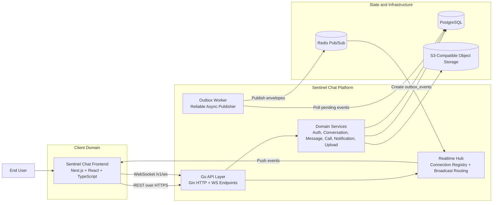

## 5.2 Container and Layered Architecture Diagram

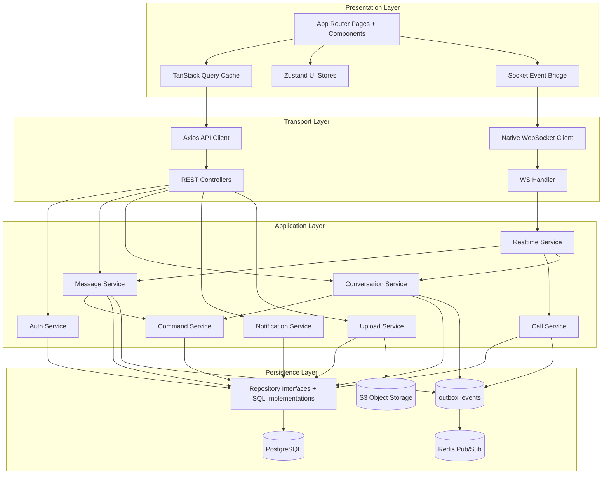

## 5.3 Enhanced ER Diagram (Core Relational Model)

```mermaid
erDiagram
    USERS {
        UUID id PK
        CITEXT email UK
        CITEXT username UK
        TEXT password_hash
        BOOLEAN is_online
        BOOLEAN is_verified
        TIMESTAMP created_at
    }

    DEVICES {
        UUID id PK
        UUID user_id FK
        TEXT device_id
        TEXT device_type
        BOOLEAN is_active
        TIMESTAMP last_seen_at
    }

    USER_SESSIONS {
        UUID id PK
        UUID user_id FK
        UUID device_id FK
        TEXT refresh_token_hash
        TEXT auth_provider
        TIMESTAMP expires_at
        BOOLEAN is_revoked
    }

    OAUTH_IDENTITIES {
        UUID id PK
        UUID user_id FK
        TEXT provider
        TEXT provider_user_id
        CITEXT provider_email
    }

    USER_CONTACTS {
        UUID user_id FK
        UUID contact_user_id FK
        BOOLEAN is_blocked
        TIMESTAMP created_at
    }

    CONVERSATIONS {
        UUID id PK
        conversation_type type
        UUID created_by FK
        UUID dm_user_id_a FK
        UUID dm_user_id_b FK
        disappearing_mode disappearing_mode
        TIMESTAMP updated_at
    }

    PARTICIPANTS {
        UUID conversation_id FK
        UUID user_id FK
        participant_role role
        TIMESTAMP muted_until
        BOOLEAN archived
        BIGINT last_read_sequence
    }

    CONVERSATION_SEQUENCES {
        UUID conversation_id PK, FK
        BIGINT last_sequence
        TIMESTAMP updated_at
    }

    MESSAGES {
        UUID id PK
        UUID conversation_id FK
        UUID sender_id FK
        BIGINT seq_id
        message_type type
        TEXT content
        UUID poll_id FK
        TIMESTAMP deleted_at
        TIMESTAMP expires_at
    }

    MESSAGE_RECEIPTS {
        UUID message_id FK
        UUID user_id FK
        delivery_status status
        TIMESTAMP updated_at
    }

    MESSAGE_REACTIONS {
        UUID id PK
        UUID message_id FK
        UUID user_id FK
        VARCHAR reaction_code
        TIMESTAMP created_at
    }

    ATTACHMENTS {
        UUID id PK
        UUID uploader_id FK
        TEXT file_url
        TEXT mime_type
        BIGINT size_bytes
        BOOLEAN view_once
        TIMESTAMP viewed_at
    }

    MESSAGE_ATTACHMENTS {
        UUID message_id FK
        UUID attachment_id FK
    }

    POLLS {
        UUID id PK
        UUID message_id FK
        TEXT question
        BOOLEAN allows_multiple
        TIMESTAMP closes_at
    }

    POLL_OPTIONS {
        UUID id PK
        UUID poll_id FK
        TEXT option_text
        INTEGER position
    }

    POLL_VOTES {
        UUID poll_id FK
        UUID option_id FK
        UUID user_id FK
        TIMESTAMP voted_at
    }

    CALLS {
        UUID id PK
        UUID conversation_id FK
        UUID initiated_by FK
        call_type type
        TIMESTAMP started_at
        TIMESTAMP ended_at
    }

    COMMAND_LOGS {
        UUID id PK
        UUID user_id FK
        UUID conversation_id FK
        VARCHAR command_type
        command_status status
        JSONB payload
        JSONB undo_payload
    }

    OUTBOX_EVENTS {
        UUID id PK
        VARCHAR event_type
        VARCHAR aggregate_type
        VARCHAR aggregate_id
        JSONB payload
        outbox_status status
    }

    NOTIFICATIONS {
        UUID id PK
        UUID user_id FK
        UUID actor_id FK
        UUID conversation_id FK
        UUID message_id FK
        UUID call_id FK
        VARCHAR type
        BOOLEAN is_read
    }

    USER_NOTIFICATION_SETTINGS {
        UUID user_id PK, FK
        BOOLEAN in_app_enabled
        BOOLEAN sound_enabled
        BOOLEAN show_message_preview
    }

    USERS ||--o{ DEVICES : owns
    USERS ||--o{ USER_SESSIONS : signs_in
    USERS ||--o{ OAUTH_IDENTITIES : links
    USERS ||--o{ USER_CONTACTS : connects
    USERS ||--o{ PARTICIPANTS : joins
    USERS ||--o{ MESSAGES : sends
    USERS ||--o{ MESSAGE_REACTIONS : reacts
    USERS ||--o{ MESSAGE_RECEIPTS : acknowledges
    USERS ||--o{ POLL_VOTES : votes
    USERS ||--o{ COMMAND_LOGS : executes
    USERS ||--o{ NOTIFICATIONS : receives
    USERS ||--o| USER_NOTIFICATION_SETTINGS : configures

    CONVERSATIONS ||--o{ PARTICIPANTS : contains
    CONVERSATIONS ||--|| CONVERSATION_SEQUENCES : orders
    CONVERSATIONS ||--o{ MESSAGES : stores
    CONVERSATIONS ||--o{ CALLS : hosts

    MESSAGES ||--o{ MESSAGE_RECEIPTS : tracks
    MESSAGES ||--o{ MESSAGE_REACTIONS : aggregates
    MESSAGES ||--o{ MESSAGE_ATTACHMENTS : maps
    ATTACHMENTS ||--o{ MESSAGE_ATTACHMENTS : maps

    MESSAGES ||--o| POLLS : optional_poll
    POLLS ||--o{ POLL_OPTIONS : defines
    POLLS ||--o{ POLL_VOTES : records

    CONVERSATIONS ||--o{ COMMAND_LOGS : scopes
    CONVERSATIONS ||--o{ OUTBOX_EVENTS : emits
    CONVERSATIONS ||--o{ NOTIFICATIONS : contextualizes
```

## 5.4 Sequence Diagram: Message Send, Fan-out, and Receipt Convergence

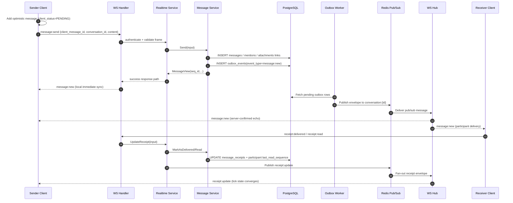

## 5.5 Sequence Diagram: WebRTC Call Signaling over WebSocket

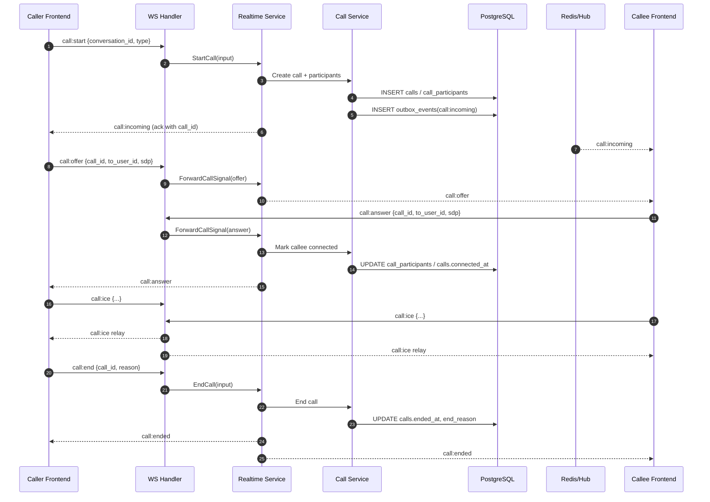

## 5.6 State Diagram: Message Lifecycle and Client Convergence

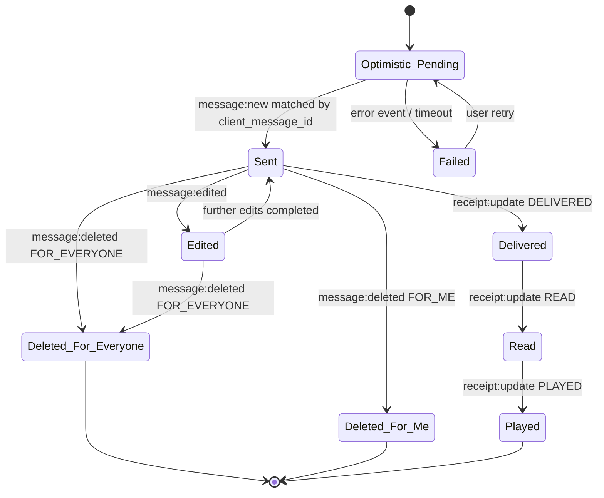

## 5.7 Frontend Synchronization Diagram (HTTP Pull + WS Push + Optimistic Writes)

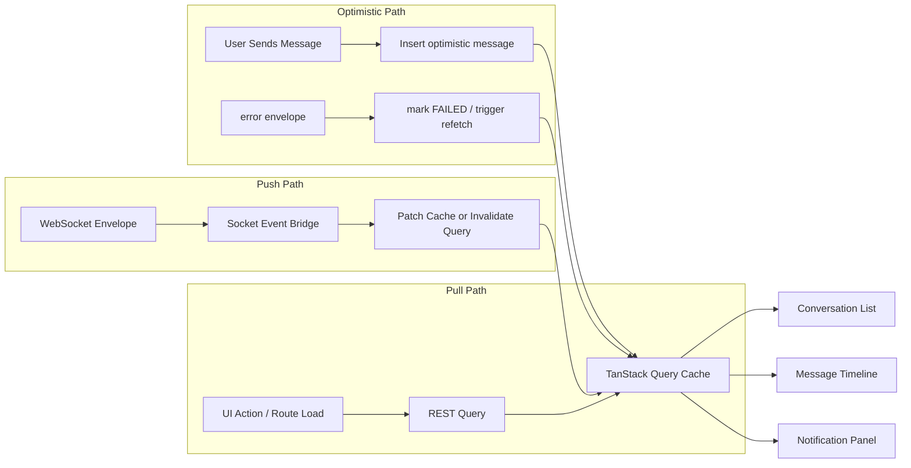

## 5.8 Reliability Diagram: Transactional Outbox Pattern

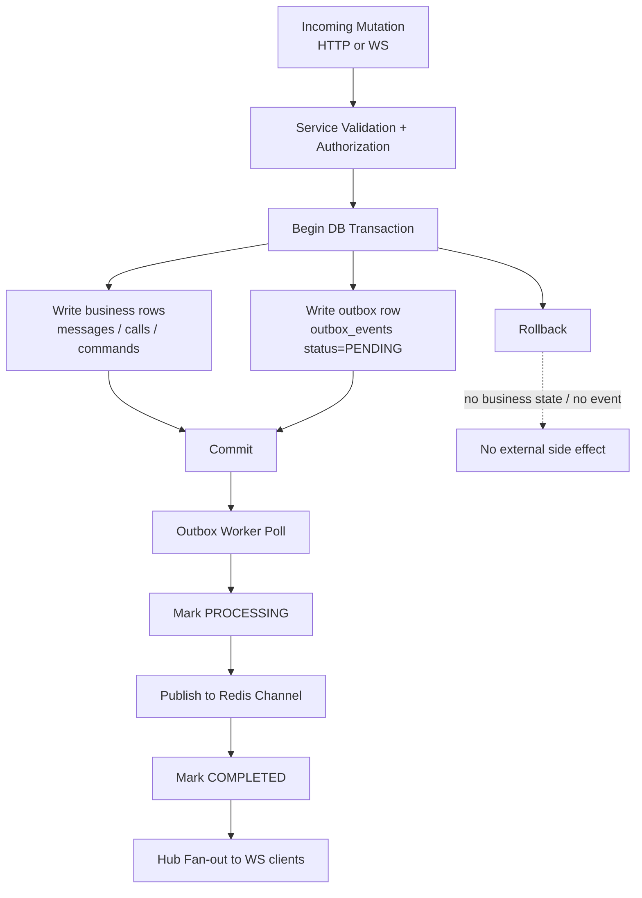

## 5.9 Deployment Diagram (Scale-out Ready)

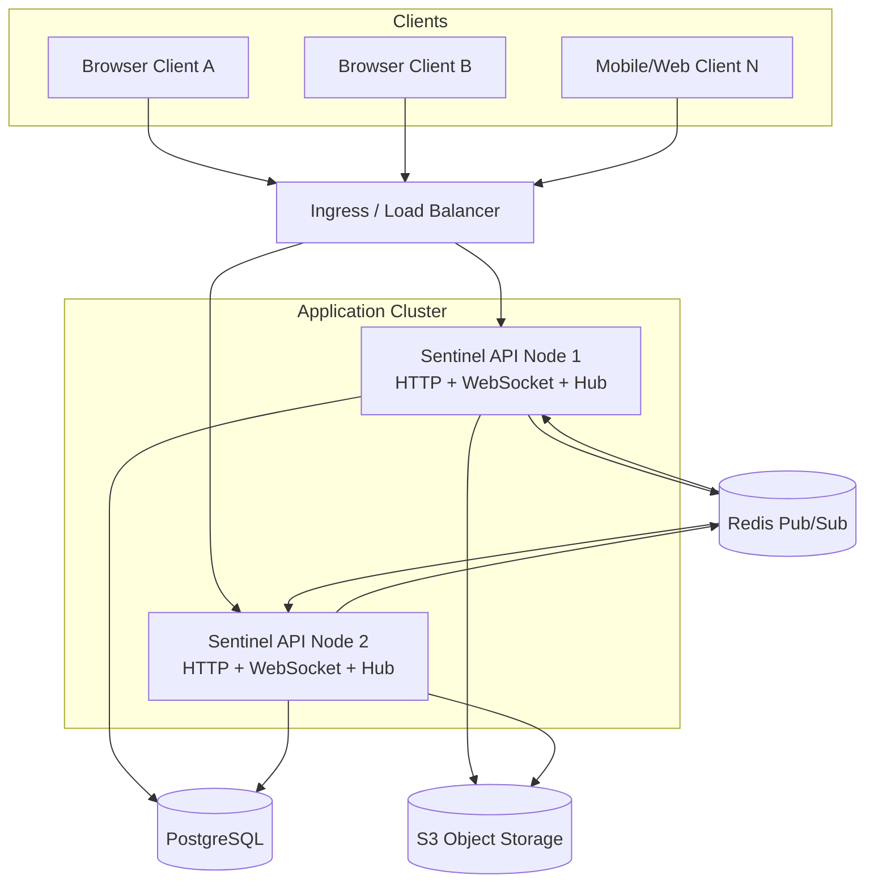

## 5.10 Snapshot Checklist for Final Submission

Add screenshots in the final report appendix (recommended minimum):
- Login/register UI and session-aware auth response flow.
- Conversation list with unread counters and presence signals.
- Chat area with message lifecycle events (new/edit/delete/reaction/receipt).
- Poll creation and vote update behavior.
- Notification panel and badge sync behavior.
- Call modal/overlay with signaling states.

---

## 6. Experimentation and Analysis

## 6.1 Experimental Scope (How Much Data Was Analyzed)

The analysis covered:
- Full backend and frontend source architecture (203 files, 36,418 LOC).
- Full migration schema (29 tables, 46 indexes).
- Runtime interface inventory (39 HTTP endpoints, 53 socket events).
- Seeded baseline relational dataset after development reseed.

## 6.2 Number of Registrations and Data Sample

Seeded baseline user graph:
- Registrations analyzed: 7 users (1 admin + 6 test users).
- Device registrations: 7.
- OAuth identities: 4.
- Contacts: 12 edges.
- DM conversations: 6.

## 6.3 Dataset Table (Baseline)

| Table | Row Count |
|-------|-----------|
| users | 7 |
| devices | 7 |
| oauth_identities | 4 |
| user_contacts | 12 |
| conversations | 6 |
| participants | 12 |
| messages | 0 |
| notifications | 0 |
| calls | 0 |
| outbox_events | 0 |
| command_logs | 0 |

Interpretation: the seeded graph provides a controlled baseline for structural testing before message-level workload replay.

## 6.4 API and Event Surface Tables

### HTTP Endpoint Distribution

| Method | Count |
|--------|-------|
| GET | 16 |
| POST | 16 |
| PATCH | 4 |
| DELETE | 3 |
| PUT | 0 |

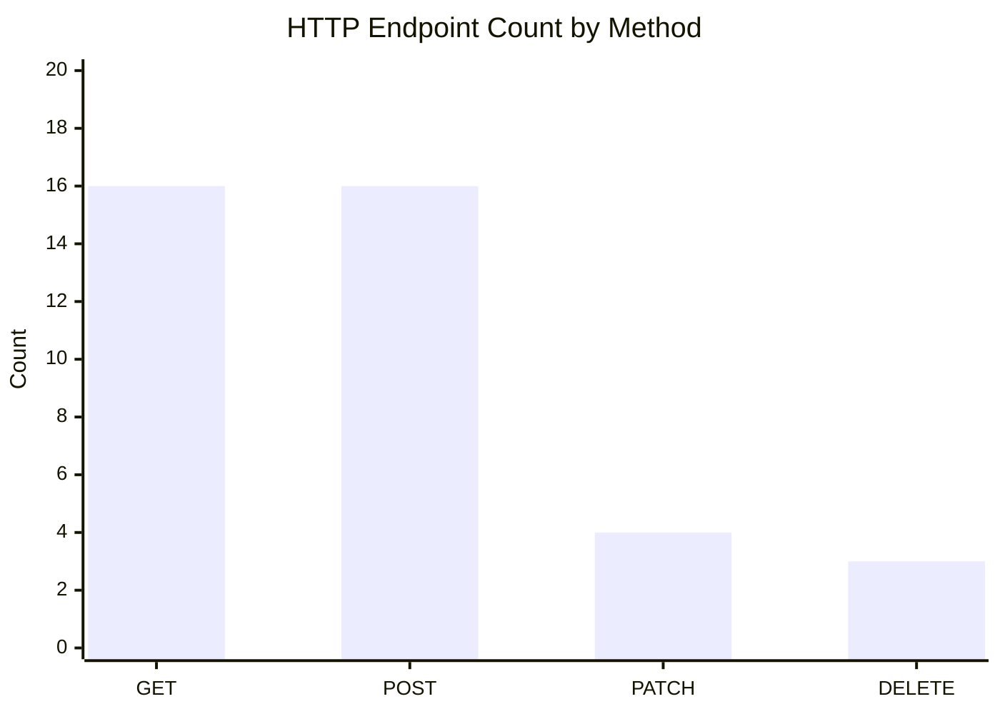

### WebSocket Event Taxonomy

| Namespace | Count |
|-----------|-------|
| message | 14 |
| call | 10 |
| conversation | 5 |
| notification | 5 |
| receipt | 4 |
| typing | 4 |
| command | 4 |
| poll | 3 |
| connection | 1 |
| presence | 1 |
| ping | 1 |
| error | 1 |

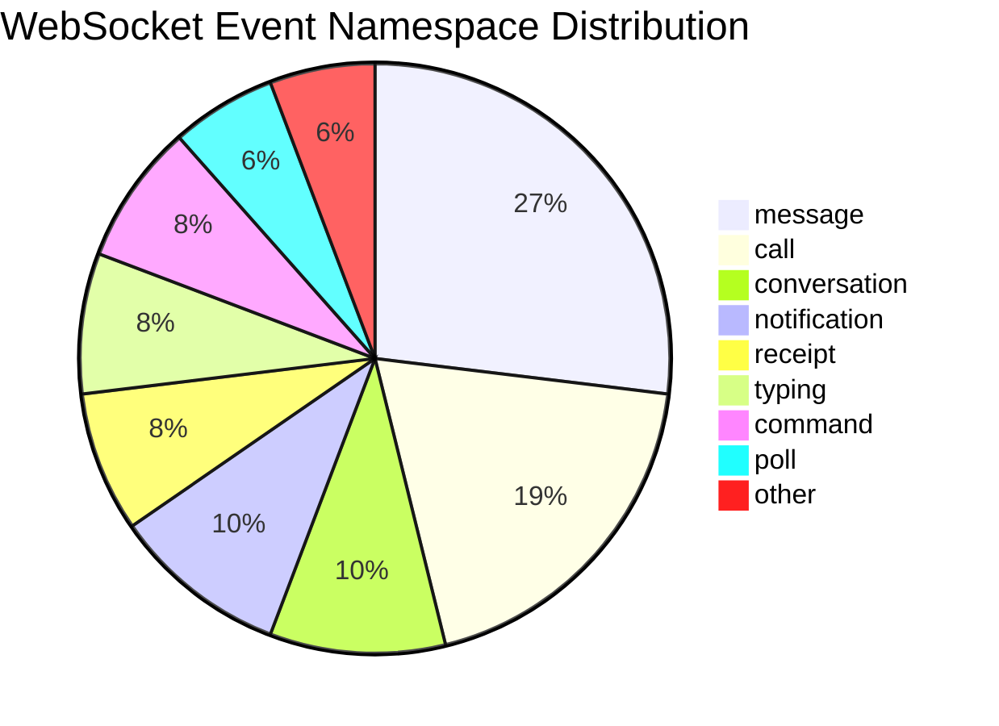

## 6.5 Frontend and Backend Structural Footprint

| Layer | Files | LOC |
|-------|------:|----:|
| Backend Go | 72 | 17,695 |
| Frontend TS/TSX | 131 | 18,723 |
| Total | 203 | 36,418 |

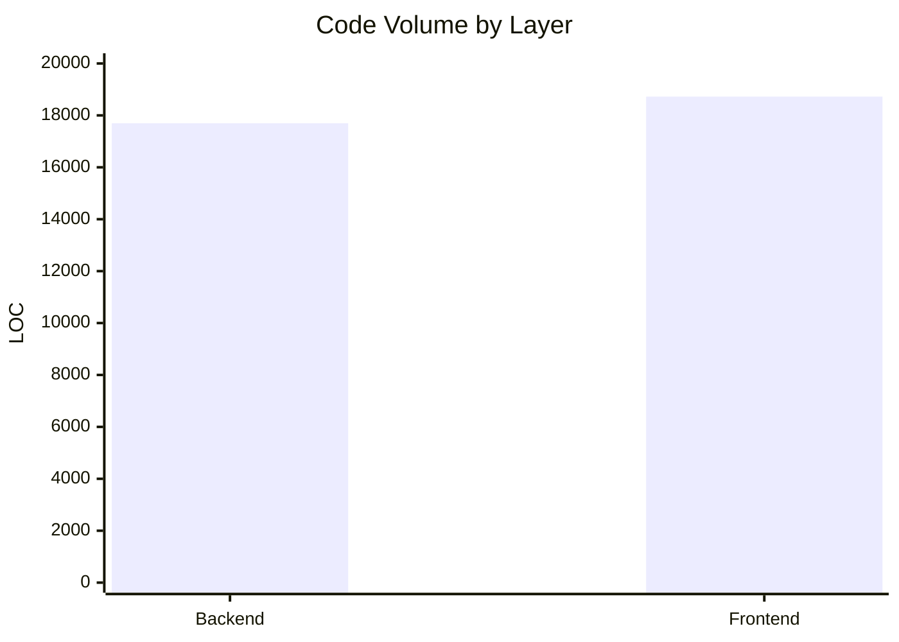

## 6.6 Qualitative Analysis

### Reliability
- Outbox worker plus durable `outbox_events` table provides safer asynchronous delivery than direct publish-only architecture.
- Message sequence assignment per conversation and read-sequence tracking improve order-aware UX consistency.

### Security and Access Control
- JWT access tokens, refresh-token hashing, session revocation, and device-aware validation provide strong session governance.
- Route-level auth middleware and participant checks enforce conversation-bound authorization.

### Maintainability
- Service and repository boundaries reduce coupling and localize domain logic.
- Event naming consistency (`namespace:action`) enables predictable frontend subscription handling.

### UX Consistency
- Optimistic updates + socket reconciliation + query invalidation create a resilient user-perceived state model.
- Receipt and poll updates are patched directly into cache to reduce full reload pressure.

## 6.7 Empirical Analysis and Result Discussion

1. **Balanced API shape:** GET and POST parity indicates both retrieval and mutation are treated as first-class operations, while PATCH is selectively used for state transitions.
2. **Event-heavy message domain:** Message-related events dominate socket taxonomy, which is expected in chat systems but implies careful client-side event ordering logic is mandatory.
3. **Schema richness:** 29 relational tables suggest broad feature support; however, it also increases migration and query-plan governance requirements.
4. **Controlled baseline graph:** 7 registrations and 12 contact edges are suitable for correctness validation but insufficient for scale benchmarking; larger synthetic datasets are recommended for latency profiling.

---

## 7. Critical Analysis

## 7.1 Strengths
- Clear pattern-driven architecture (Repository, Service, Command, Outbox, Pub/Sub).
- Strong session and device control model.
- Explicit support for rich chat primitives: reactions, receipts, polls, attachments, and call signaling.
- Frontend realtime cache strategy is mature and production-aligned.

## 7.2 Limitations
- Current repository state emphasizes secure transport/session control; protocol-level end-to-end cryptographic lifecycle is not fully formalized in active message paths.
- Build/lint quality checks pass build but still show frontend lint warnings that should be resolved before final release.
- Baseline experimental dataset is good for correctness validation but not for stress-level latency claims.

## 7.3 Threats to Validity
- Static architecture metrics do not directly prove runtime performance under high concurrent load.
- Seeded synthetic data may not capture realistic social graph density or message burst patterns.

---

## 8. Conclusion

This project demonstrates a practical and technically coherent full-stack architecture for real-time messaging where consistency is achieved through coordinated backend reliability patterns and frontend state convergence logic. The most important contribution is not a single feature but an integration strategy: transactional persistence, asynchronous event delivery, and reactive UI synchronization are treated as one system design problem.

From a research perspective, Sentinel Chat aligns well with current secure messaging and real-time systems literature, especially in architecture and reliability dimensions. The next high-impact improvement is to extend the current secure-session model toward stronger end-to-end cryptographic guarantees with explicit protocol-state validation and metadata-hardening mechanisms inspired by recent MLS research.

---

## 9. References (IEEE-style, suitable for two-column manuscripts)

[1] N. Unger, S. Dechand, J. Bonneau, S. Fahl, H. Perl, I. Goldberg, and M. Smith, "SoK: Secure Messaging," in *2015 IEEE Symposium on Security and Privacy*, 2015. doi: 10.1109/SP.2015.22

[2] K. Cohn-Gordon, C. Cremers, B. Dowling, L. Garratt, and D. Stebila, "A Formal Security Analysis of the Signal Messaging Protocol," in *2017 IEEE European Symposium on Security and Privacy (EuroS&P)*, 2017. doi: 10.1109/EuroSP.2017.27

[3] J. Alwen, S. Coretti, and Y. Dodis, "The Double Ratchet: Security Notions, Proofs, and Modularization for the Signal Protocol," in *EUROCRYPT 2019*, 2019. doi: 10.1007/978-3-030-17653-2_5

[4] P. Grubbs, J. Lu, and T. Ristenpart, "Message Franking via Committing Authenticated Encryption," in *CRYPTO 2017*, 2017. doi: 10.1007/978-3-319-63697-9_3

[5] M. Chase, T. Perrin, and G. Zaverucha, "The Signal Private Group System and Anonymous Credentials Supporting Efficient Verifiable Encryption," in *Proceedings of the 2020 ACM SIGSAC Conference on Computer and Communications Security (CCS)*, 2020. doi: 10.1145/3372297.3417887

[6] J. Alwen, S. Coretti, Y. Dodis, and Y. Tselekounis, "Modular Design of Secure Group Messaging Protocols and the Security of MLS," in *Proceedings of the 2021 ACM SIGSAC Conference on Computer and Communications Security (CCS)*, 2021. doi: 10.1145/3460120.3484820

[7] K. Klein et al., "Keep the Dirt: Tainted TreeKEM, Adaptively and Actively Secure Continuous Group Key Agreement," in *2021 IEEE Symposium on Security and Privacy (SP)*, 2021. doi: 10.1109/SP40001.2021.00035

[8] K. Hashimoto, S. Katsumata, and T. Prest, "How to Hide MetaData in MLS-Like Secure Group Messaging," in *Proceedings of the 2022 ACM SIGSAC Conference on Computer and Communications Security (CCS)*, 2022. doi: 10.1145/3548606.3560679

[9] D. Balbas, D. Collins, and S. Vaudenay, "Cryptographic Administration for Secure Group Messaging," in *32nd USENIX Security Symposium (USENIX Security 23)*, 2023. [Online]. Available: https://www.usenix.org/conference/usenixsecurity23/presentation/balbas

[10] P. Murley, Z. Ma, J. Mason, M. Bailey, and A. Kharraz, "WebSocket Adoption and the Landscape of the Real-Time Web," in *Proceedings of The Web Conference 2021*, 2021. doi: 10.1145/3442381.3450063

[11] J. Kreps, N. Narkhede, and J. Rao, "Kafka: a Distributed Messaging System for Log Processing," in *NetDB*, 2011. [Online]. Available: https://www.usenix.org/system/files/conference/netdb11/netdb11-final41.pdf

[12] S. Das et al., "All Aboard the Databus! LinkedIn's Scalable Consistent Change Data Capture Platform," in *Proceedings of the 3rd ACM Symposium on Cloud Computing (SoCC)*, 2012. doi: 10.1145/2391229.2391247

[13] M. De Fre, J. van der Hooft, T. Wauters, and F. De Turck, "Scalable MDC-Based Volumetric Video Delivery for Real-Time One-to-Many WebRTC Conferencing," in *Proceedings of the ACM Multimedia Systems Conference 2024*, 2024. doi: 10.1145/3625468.3647617

---

## 10. Suggested Final Submission Packaging

For your teacher submission, convert this draft into:
1. IEEE two-column format (title, abstract, keywords, numbered sections).
2. Add project screenshots in an appendix.
3. Keep references in IEEE numeric style exactly as listed.
