# Sentinal Chat - Database Design & Architecture

> A scalable, event-driven real-time chat application using Go, PostgreSQL, Redis, and WebSockets.

---

## Table of Contents

1. [Entity Relationship Diagram (ERD)](#entity-relationship-diagram-erd)
2. [PostgreSQL Extensions](#postgresql-extensions)
3. [Custom Enums](#custom-enums)
4. [Tables & Schema](#tables--schema)
5. [Database Triggers & Functions](#database-triggers--functions)
6. [Indexes](#indexes)
7. [Design Patterns](#design-patterns)
8. [Authentication Architecture](#authentication-architecture)
9. [Recommended GitHub Repositories](#recommended-github-repositories)
10. [Scalability Notes](#scalability-notes)

---

## Entity Relationship Diagram (ERD)

```mermaid
erDiagram
    %% ==================== USERS ====================
    USERS {
        uuid id PK "uuid_generate_v4()"
        citext phone_number UK "nullable"
        citext username UK "nullable"
        citext email UK "nullable"
        text password_hash "NOT NULL"
        text display_name "NOT NULL"
        text bio "nullable"
        text avatar_url "nullable"
        boolean is_online "default: false"
        timestamp last_seen_at "nullable"
        boolean is_active "default: true"
        boolean is_verified "default: false"
        timestamp created_at "default: NOW()"
        timestamp updated_at "default: NOW()"
    }

    USER_SETTINGS {
        uuid user_id PK,FK
        privacy_setting privacy_last_seen "default: EVERYONE"
        privacy_setting privacy_profile_photo "default: EVERYONE"
        privacy_setting privacy_about "default: EVERYONE"
        privacy_setting privacy_groups "default: EVERYONE"
        boolean read_receipts "default: true"
        boolean notifications_enabled "default: true"
        text notification_sound "default: 'default'"
        boolean notification_vibrate "default: true"
        theme_mode theme "default: SYSTEM"
        language_code language "default: 'en'"
        boolean enter_to_send "default: true"
        boolean media_auto_download_wifi "default: true"
        boolean media_auto_download_mobile "default: false"
        timestamp updated_at "default: NOW()"
    }

    USER_SESSIONS {
        uuid id PK "uuid_generate_v4()"
        uuid user_id FK "NOT NULL"
        text device_id "NOT NULL"
        text device_type "nullable"
        text ip_address "nullable"
        text user_agent "nullable"
        text refresh_token_hash "NOT NULL"
        timestamp expires_at "NOT NULL"
        boolean is_revoked "default: false"
        timestamp created_at "default: NOW()"
    }

    USER_CONTACTS {
        uuid user_id PK,FK
        uuid contact_user_id PK,FK
        text nickname "nullable"
        boolean is_blocked "default: false"
        timestamp created_at "default: NOW()"
    }

    %% ==================== CONVERSATIONS ====================
    CONVERSATIONS {
        uuid id PK "uuid_generate_v4()"
        conversation_type type "NOT NULL"
        text subject "nullable"
        text description "nullable"
        text avatar_url "nullable"
        integer expiry_seconds "nullable"
        uuid created_by FK "nullable"
        timestamp created_at "default: NOW()"
        timestamp updated_at "default: NOW()"
    }

    PARTICIPANTS {
        uuid conversation_id PK,FK
        uuid user_id PK,FK
        participant_role role "default: MEMBER"
        timestamp joined_at "default: NOW()"
        uuid added_by FK "nullable"
        timestamp muted_until "nullable"
        timestamp pinned_at "nullable"
        boolean archived "default: false"
        bigint last_read_sequence "default: 0"
    }

    CONVERSATION_SEQUENCES {
        uuid conversation_id PK,FK
        bigint last_sequence "default: 0"
        timestamp updated_at "default: NOW()"
    }

    %% ==================== MESSAGES ====================
    MESSAGES {
        uuid id PK "uuid_generate_v4()"
        uuid conversation_id FK "NOT NULL"
        uuid sender_id FK "NOT NULL"
        bigint seq_id "assigned by trigger"
        message_type type "default: TEXT"
        text content "nullable"
        jsonb metadata "nullable"
        boolean is_forwarded "default: false"
        uuid forwarded_from_msg_id FK "nullable"
        uuid reply_to_msg_id FK "nullable"
        timestamp created_at "default: NOW()"
        timestamp edited_at "nullable"
        timestamp deleted_at "nullable"
    }

    MESSAGE_REACTIONS {
        uuid id PK "uuid_generate_v4()"
        uuid message_id FK "NOT NULL"
        uuid user_id FK "NOT NULL"
        varchar reaction_code "NOT NULL"
        timestamp created_at "default: NOW()"
    }

    MESSAGE_RECEIPTS {
        uuid message_id PK,FK
        uuid user_id PK,FK
        delivery_status status "default: PENDING"
        timestamp delivered_at "nullable"
        timestamp read_at "nullable"
        timestamp updated_at "default: NOW()"
    }

    %% ==================== ATTACHMENTS ====================
    ATTACHMENTS {
        uuid id PK "uuid_generate_v4()"
        uuid uploader_id FK "nullable"
        text url "NOT NULL"
        text filename "nullable"
        text mime_type "NOT NULL"
        bigint size_bytes "NOT NULL"
        timestamp created_at "default: NOW()"
    }

    MESSAGE_ATTACHMENTS {
        uuid message_id PK,FK
        uuid attachment_id PK,FK
    }

    %% ==================== EVENT SOURCING ====================
    OUTBOX_EVENTS {
        uuid id PK "uuid_generate_v4()"
        text aggregate_type "NOT NULL"
        uuid aggregate_id "NOT NULL"
        text event_type "NOT NULL"
        jsonb payload "NOT NULL"
        timestamp created_at "default: NOW()"
        timestamp processed_at "nullable"
    }

    %% ==================== RELATIONSHIPS ====================
    USERS ||--o| USER_SETTINGS : "has"
    USERS ||--o{ USER_SESSIONS : "has"
    USERS ||--o{ USER_CONTACTS : "has contacts"
    USERS ||--o{ PARTICIPANTS : "participates in"
    USERS ||--o{ MESSAGES : "sends"
    USERS ||--o{ MESSAGE_REACTIONS : "reacts"
    USERS ||--o{ ATTACHMENTS : "uploads"

    CONVERSATIONS ||--o{ PARTICIPANTS : "has"
    CONVERSATIONS ||--o| CONVERSATION_SEQUENCES : "tracks sequence"
    CONVERSATIONS ||--o{ MESSAGES : "contains"

    MESSAGES ||--o{ MESSAGE_REACTIONS : "has"
    MESSAGES ||--o{ MESSAGE_RECEIPTS : "has"
    MESSAGES ||--o{ MESSAGE_ATTACHMENTS : "has"
    MESSAGES ||--o| MESSAGES : "replies to/forwards"

    ATTACHMENTS ||--o{ MESSAGE_ATTACHMENTS : "linked to"
```



---

## PostgreSQL Extensions

```sql
CREATE EXTENSION IF NOT EXISTS "uuid-ossp";    -- UUID generation
CREATE EXTENSION IF NOT EXISTS "pgcrypto";     -- Password hashing
CREATE EXTENSION IF NOT EXISTS "citext";       -- Case-insensitive text
```

---

## Custom Enums

```sql
CREATE TYPE conversation_type AS ENUM ('DM', 'GROUP');
CREATE TYPE participant_role AS ENUM ('OWNER', 'ADMIN', 'MEMBER');
CREATE TYPE message_type AS ENUM ('TEXT', 'IMAGE', 'VIDEO', 'AUDIO', 'FILE', 'LOCATION', 'CONTACT', 'SYSTEM', 'STICKER', 'GIF');
CREATE TYPE delivery_status AS ENUM ('PENDING', 'SENT', 'DELIVERED', 'READ');
CREATE TYPE privacy_setting AS ENUM ('EVERYONE', 'CONTACTS', 'NOBODY');
CREATE TYPE theme_mode AS ENUM ('SYSTEM', 'LIGHT', 'DARK');
CREATE TYPE language_code AS ENUM ('en', 'es', 'fr', 'de', 'pt', 'ru', 'hi', 'zh', 'ar', 'ja');
```

---

## Tables & Schema

| Table | Purpose |
|-------|---------|
| `users` | User accounts with authentication |
| `user_settings` | User preferences & privacy |
| `user_sessions` | Active sessions (multi-device) |
| `user_contacts` | Contact list & blocked users |
| `conversations` | Chat containers (DM/Group) |
| `participants` | User-conversation membership |
| `conversation_sequences` | Message ordering per conversation |
| `messages` | All chat messages |
| `message_reactions` | Emoji reactions |
| `message_receipts` | Delivery/read status per user |
| `attachments` | Media/file metadata |
| `message_attachments` | Message-attachment join table |
| `outbox_events` | Transactional outbox for events |

---

## Database Triggers & Functions

### Message Sequence Assignment

```sql
CREATE OR REPLACE FUNCTION fn_assign_message_sequence()
RETURNS TRIGGER LANGUAGE plpgsql AS $$
DECLARE
    next_seq BIGINT;
BEGIN
    INSERT INTO conversation_sequences (conversation_id, last_sequence)
    VALUES (NEW.conversation_id, 0)
    ON CONFLICT (conversation_id) DO NOTHING;

    UPDATE conversation_sequences
    SET last_sequence = last_sequence + 1, updated_at = NOW()
    WHERE conversation_id = NEW.conversation_id
    RETURNING last_sequence INTO next_seq;

    NEW.seq_id := next_seq;
    RETURN NEW;
END;
$$;

CREATE TRIGGER tr_messages_assign_sequence
BEFORE INSERT ON messages FOR EACH ROW
EXECUTE FUNCTION fn_assign_message_sequence();
```

### Auto-Update Timestamps

```sql
CREATE OR REPLACE FUNCTION fn_update_timestamp()
RETURNS TRIGGER LANGUAGE plpgsql AS $$
BEGIN
    NEW.updated_at = NOW();
    RETURN NEW;
END;
$$;

-- Apply to relevant tables
CREATE TRIGGER tr_users_updated BEFORE UPDATE ON users FOR EACH ROW EXECUTE FUNCTION fn_update_timestamp();
CREATE TRIGGER tr_conversations_updated BEFORE UPDATE ON conversations FOR EACH ROW EXECUTE FUNCTION fn_update_timestamp();
```

### Update Conversation on New Message

```sql
CREATE OR REPLACE FUNCTION fn_update_conversation_on_message()
RETURNS TRIGGER LANGUAGE plpgsql AS $$
BEGIN
    UPDATE conversations SET updated_at = NOW() WHERE id = NEW.conversation_id;
    RETURN NEW;
END;
$$;

CREATE TRIGGER tr_message_updates_conversation
AFTER INSERT ON messages FOR EACH ROW
EXECUTE FUNCTION fn_update_conversation_on_message();
```

---

## Indexes

```sql
-- Users
CREATE INDEX idx_users_phone ON users (phone_number) WHERE phone_number IS NOT NULL;
CREATE INDEX idx_users_username ON users (username) WHERE username IS NOT NULL;
CREATE INDEX idx_users_email ON users (email) WHERE email IS NOT NULL;

-- Sessions
CREATE INDEX idx_sessions_user ON user_sessions (user_id);
CREATE INDEX idx_sessions_expires ON user_sessions (expires_at) WHERE is_revoked = false;

-- Participants
CREATE INDEX idx_participants_user ON participants (user_id);
CREATE INDEX idx_participants_conv ON participants (conversation_id);

-- Messages (critical for performance)
CREATE INDEX idx_messages_conv_seq ON messages (conversation_id, seq_id DESC);
CREATE INDEX idx_messages_sender ON messages (sender_id);
CREATE INDEX idx_messages_content_gin ON messages USING gin(to_tsvector('english', content)) 
    WHERE content IS NOT NULL AND deleted_at IS NULL;

-- Receipts & Reactions
CREATE INDEX idx_receipts_message ON message_receipts (message_id);
CREATE INDEX idx_reactions_message ON message_reactions (message_id);

-- Conversations
CREATE INDEX idx_conversations_updated ON conversations (updated_at DESC);

-- Outbox
CREATE INDEX idx_outbox_pending ON outbox_events (created_at) WHERE processed_at IS NULL;
```

---

## Design Patterns

### 1. Observer Pattern — Message Updates

**Purpose:** Notify all connected clients when messages are created, updated, or deleted.

**How it works:**
- When a message event occurs, publish to Redis Pub/Sub channels
- WebSocket handlers subscribe to relevant channels
- All connected clients in that conversation receive real-time updates

**Events:**
- `message.created` — New message received
- `message.updated` — Message edited
- `message.deleted` — Message deleted
- `typing.started` / `typing.stopped` — Typing indicators
- `receipt.updated` — Delivery/read status changed

**Flow:**
```
┌──────────────┐    ┌─────────────────┐    ┌───────────────┐    ┌────────────┐
│ Chat Service │───▶│ Redis Pub/Sub   │───▶│ WS Hub        │───▶│ WS Clients │
│ (Publisher)  │    │ (Event Broker)  │    │ (Subscribers) │    │ (Observers)│
└──────────────┘    └─────────────────┘    └───────────────┘    └────────────┘
```

**Channel naming:**
- `conversation:{conversation_id}` — Group messages
- `user:{user_id}` — Direct notifications

---

### 2. Proxy Pattern — Access Control

**Purpose:** Control access to resources before reaching the actual service/repository.

**How it works:**
- Proxy layer sits between handlers and services
- Validates permissions before allowing operations
- Enforces authorization rules consistently

**Use cases:**
- Check if user is participant before accessing conversation
- Validate admin/owner role before modifying group settings
- Enforce rate limits on message sends
- Block access to resources from blocked users

**Flow:**
```
┌──────────────┐    ┌─────────────────────────┐    ┌──────────────┐
│   Handler    │───▶│   Access Control Proxy  │───▶│   Service    │
│              │    │   - IsParticipant?      │    │              │
│              │    │   - HasRole(ADMIN)?     │    │              │
│              │    │   - IsBlocked?          │    │              │
│              │    │   - RateLimitOK?        │    │              │
└──────────────┘    └─────────────────────────┘    └──────────────┘
```

**Checks:**
| Action | Required Permission |
|--------|---------------------|
| View messages | Must be participant |
| Send message | Must be participant + not muted |
| Add member | Must be ADMIN or OWNER |
| Remove member | Must be ADMIN or OWNER |
| Delete group | Must be OWNER |
| Update group info | Must be ADMIN or OWNER |

---

### 3. Command Pattern — Store Chat Actions

**Purpose:** Encapsulate chat actions as command objects that can be stored, validated, executed, and logged.

**How it works:**
- Each user action becomes a command object
- Commands are validated, then persisted to database
- Commands trigger domain events for Observer pattern
- Enables audit logging and action replay

**Commands:**
| Command | Data Stored | Events Triggered |
|---------|-------------|------------------|
| `SendMessageCommand` | Message content, attachments, reply_to | `message.created` |
| `EditMessageCommand` | Message ID, new content | `message.updated` |
| `DeleteMessageCommand` | Message ID, delete_for_all | `message.deleted` |
| `ReactToMessageCommand` | Message ID, reaction code | `reaction.added` |
| `CreateGroupCommand` | Subject, members, avatar | `conversation.created` |
| `AddMemberCommand` | Conversation ID, user IDs | `member.added` |
| `RemoveMemberCommand` | Conversation ID, user ID | `member.removed` |
| `UpdateGroupCommand` | Conversation ID, updates | `conversation.updated` |

**Flow:**
```
┌──────────────┐    ┌──────────────────┐    ┌───────────┐    ┌──────────────┐
│   Handler    │───▶│   Command        │───▶│ Database  │───▶│ Outbox Event │
│              │    │   - Validate()   │    │ (Store)   │    │ (Publish)    │
│              │    │   - Execute()    │    │           │    │              │
└──────────────┘    └──────────────────┘    └───────────┘    └──────────────┘
```

---

### Redis Caching Strategy

**Cached in Redis:**
- User profiles (TTL: 5 min)
- Active sessions (TTL: matches session expiry)
- Conversation metadata (TTL: 5 min)
- Online status (real-time)

**Not cached (always from DB):**
- Messages (use cursor pagination)
- Message receipts
- Sensitive auth data

---

## Authentication Architecture

### Token Strategy

| Token | Storage | Lifetime |
|-------|---------|----------|
| Access Token (JWT) | Client memory | 15 minutes |
| Refresh Token (opaque) | HTTP-only cookie + DB | 7 days |

### Password Hashing

```sql
-- Using pgcrypto
SELECT crypt('user_password', gen_salt('bf', 12));
```

### Session Management

- Stored in `user_sessions` table
- Cached in Redis for fast validation
- Supports multiple devices
- "Logout all devices" by revoking all sessions

---

## Recommended GitHub Repositories

| Repository | Stack | Best For |
|------------|-------|----------|
| **[samthehai/chat](https://github.com/samthehai/chat)** | Go, GraphQL, Redis, Clean Architecture | Clean Architecture patterns |
| **[shreyshah-06/chatApplication](https://github.com/shreyshah-06/chatApplication)** | Go, React, Redis, PostgreSQL | Full-stack with Redis Pub/Sub |
| **[senowijayanto/go-chat-app](https://github.com/senowijayanto/go-chat-app)** | Go, Redis Pub/Sub, WebSocket | Simple Redis Pub/Sub example |
| **[mahdi-eth/real-time-chat-app](https://github.com/mahdi-eth/real-time-chat-app)** | Go, WebSocket, Redis | Scalability focus |

---

## Scalability Notes

```
                    ┌─────────────────┐
                    │   Load Balancer │
                    └────────┬────────┘
                             │
         ┌───────────────────┼───────────────────┐
         ▼                   ▼                   ▼
┌─────────────────┐ ┌─────────────────┐ ┌─────────────────┐
│   App Server 1  │ │   App Server 2  │ │   App Server N  │
└────────┬────────┘ └────────┬────────┘ └────────┬────────┘
         │                   │                   │
         └───────────────────┼───────────────────┘
                             ▼
                    ┌─────────────────┐
                    │   Redis         │
                    │   (Pub/Sub +    │
                    │    Caching)     │
                    └────────┬────────┘
                             ▼
                    ┌─────────────────┐
                    │   PostgreSQL    │
                    └─────────────────┘
```

**Key points:**
- Stateless app servers (WebSocket state via Redis)
- Redis Pub/Sub for cross-server message delivery
- Redis caching for frequently accessed data
- Outbox pattern for reliable event delivery

---

> **Note:** This document is the source of truth for database design. Review and finalize before implementing.
