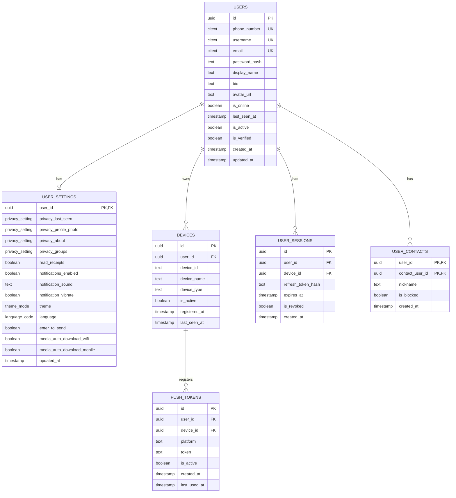
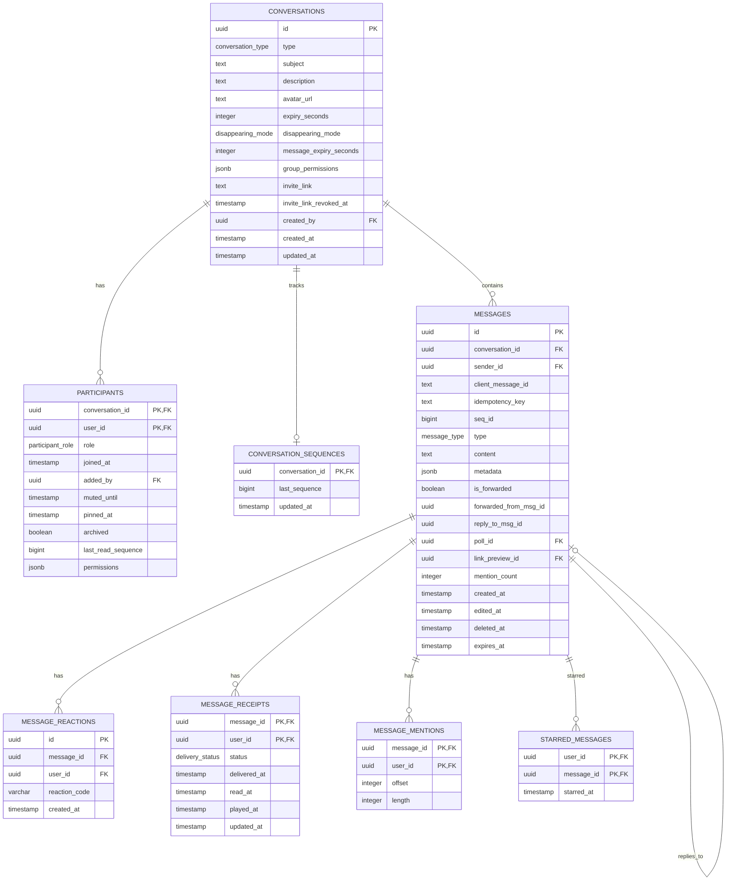
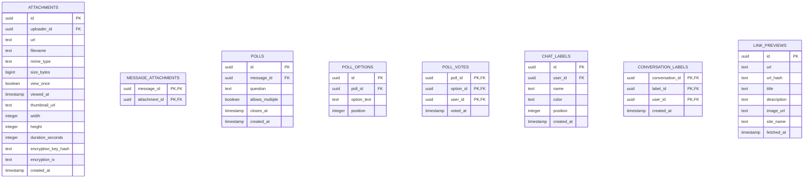
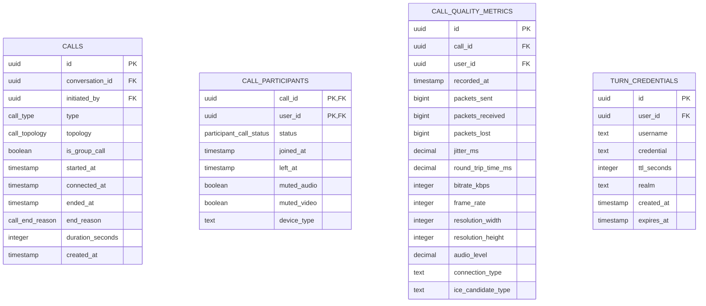
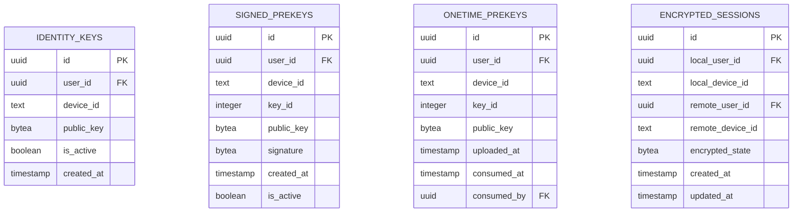

# Sentinal Chat — Database Design & Architecture (WhatsApp‑Like, Event‑Driven, Monolith)

> A production-grade, WhatsApp‑like chat backend using a **monolithic Go service**, PostgreSQL, Redis, WebSockets, and event‑driven architecture. This document is the authoritative source for schema, patterns, and infrastructure integration.

---

## Architecture and Domain Model Overview

Sentinal Chat is a monolithic Go service that exposes HTTP and WebSocket APIs. All state-changing operations are handled as commands in the application layer. Each command runs in a transaction that writes primary tables and an outbox event. Workers publish outbox events to Redis Pub/Sub, which powers WebSocket fan-out, notifications, and analytics. Redis also backs presence, session cache, rate limiting, and WebRTC signaling. PostgreSQL is the source of truth for durable state.

**Domain model summary**
- Identity and auth: users, user_settings, devices, push_tokens, user_sessions, user_contacts
- Conversations: conversations, participants, conversation_sequences
- Messages and content: messages, message_receipts, message_reactions, message_mentions, attachments, link_previews, polls, message_user_states, starred_messages
- Calls: calls, call_participants, call_quality_metrics, turn_credentials, sfu_servers, call_server_assignments
- Encryption: identity_keys, signed_prekeys, onetime_prekeys, encrypted_sessions, key_bundles
- Eventing and governance: outbox_events, outbox_event_deliveries, command_log, access_policies, event_subscriptions

**Model boundaries**
- internal/domain: entities, value objects, repository interfaces
- internal/application: command/query use cases and services
- internal/infrastructure: persistence, Redis, messaging
- internal/interfaces: HTTP and WebSocket handlers

---

## Table of Contents

- [Architecture and Domain Model Overview](#architecture-and-domain-model-overview)
- [Executive Summary](#executive-summary)
- [Technology Stack](#technology-stack)
- [Runtime Architecture Diagram](#runtime-architecture-diagram)
- [Project Folder Structure](#project-folder-structure)
- [Event‑Driven Flow](#event-driven-flow)
- [PostgreSQL Extensions](#postgresql-extensions)
- [Custom Enums](#custom-enums)
- [Entity Relationship Diagrams](#entity-relationship-diagrams)
- [Core Tables — Users & Authentication](#core-tables--users--authentication)
- [End‑to‑End Encryption (Signal Protocol)](#end-to-end-encryption-signal-protocol)
- [Conversations & Participants](#conversations--participants)
- [Messages & Content](#messages--content)
- [Attachments & Media](#attachments--media)
- [Broadcast Lists](#broadcast-lists)
- [Voice/Video Calls (WebRTC)](#voicevideo-calls-webrtc)
- [Polls](#polls)
- [Chat Organization (Labels/Starred)](#chat-organization-labelsstarred)
- [Event‑Driven Architecture Tables](#event-driven-architecture-tables)
- [Database Triggers & Functions](#database-triggers--functions)
- [Indexes](#indexes)
- [Design Patterns](#design-patterns)
- [Redis Integration](#redis-integration)
- [Authentication Architecture](#authentication-architecture)
- [Scalability Notes](#scalability-notes)
- [SQL DDL Reference (Complete)](#sql-ddl-reference-complete)
- [Appendix A — Table‑by‑Table Query Playbook](#appendix-a--table-by-table-query-playbook)
- [Appendix B — Redis Pub/Sub Channel Taxonomy](#appendix-b--redis-pubsub-channel-taxonomy)
- [Appendix C — WebSocket Message Schema](#appendix-c--websocket-message-schema)
- [Appendix D — HTTP API Sketch](#appendix-d--http-api-sketch)
- [Appendix E — Seed Data Notes](#appendix-e--seed-data-notes)
- [Appendix F — Index Rationale & Query Cost Notes](#appendix-f--index-rationale--query-cost-notes)
- [Appendix G — Event Payload Reference (Selected)](#appendix-g--event-payload-reference-selected)
- [Appendix H — Redis TTL Strategy](#appendix-h--redis-ttl-strategy)
- [Appendix I — WebRTC Topology Notes](#appendix-i--webrtc-topology-notes)
- [Appendix J — Migration Sequencing (Recommended)](#appendix-j--migration-sequencing-recommended)
- [Appendix K — Observability & Metrics](#appendix-k--observability--metrics)
- [Appendix L — Example Data Lifecycle Policies](#appendix-l--example-data-lifecycle-policies)
- [Appendix M — Constraint & Edge‑Case Notes](#appendix-m--constraint--edge-case-notes)
- [Appendix N — Security Threat Model (Summary)](#appendix-n--security-threat-model-summary)
- [Appendix O — Complete Event Payload Catalog](#appendix-o--complete-event-payload-catalog)
- [Appendix P — Column‑Level Constraints (NULL/NOT NULL)](#appendix-p--column-level-constraints-nullnot-null)
- [Appendix Q — Event Emission Rules (HTTP vs WebSocket)](#appendix-q--event-emission-rules-http-vs-websocket)
- [Appendix R — E2E Key Rotation & Recovery Flows](#appendix-r--e2e-key-rotation--recovery-flows)

---

## Executive Summary

Sentinal Chat is a WhatsApp‑like messaging platform that supports:

- Real‑time 1:1 and group messaging via WebSockets
- End‑to‑end encryption (Signal Protocol)
- Message receipts, reactions, mentions, and polls
- Voice/video calls via WebRTC with call analytics
- Broadcast lists (one‑to‑many)
- Disappearing messages and view‑once media
- Event‑driven workflows with Redis Pub/Sub and an outbox
- A monolithic Go service with a clean, modular folder structure

All critical domain events are published via the outbox pattern to Redis Pub/Sub, enabling scalable observers such as push notifications, analytics, and WebSocket fan‑out.

---

## Technology Stack

- **Go** (monolithic service)
- **PostgreSQL** (primary data store)
- **Redis** (cache, Pub/Sub, session store, presence)
- **WebSockets** (real‑time messaging and signaling)
- **WebRTC** (voice/video calls)
- **Signal Protocol** (E2E encryption)

---

## Runtime Architecture Diagram

```
┌─────────────────────────────────────────────────────────────────────────────┐
│                             MONOLITHIC GO SERVICE                           │
├─────────────────────────────────────────────────────────────────────────────┤
│                                                                             │
│  ┌──────────────┐  ┌──────────────┐  ┌──────────────┐  ┌──────────────┐     │
│  │   HTTP API   │  │  WebSocket   │  │   Command    │  │    Event     │     │
│  │   Handlers   │  │     Hub      │  │   Handlers   │  │   Processor  │     │
│  └──────┬───────┘  └──────┬───────┘  └──────┬───────┘  └──────┬───────┘     │
│         │                 │                 │                 │            │
│         └─────────────────┼─────────────────┼─────────────────┘            │
│                           │                 │                              │
│                    ┌──────▼───────┐  ┌──────▼───────┐                      │
│                    │    Access    │  │   Command    │                      │
│                    │    Proxy     │  │   Executor   │                      │
│                    └──────┬───────┘  └──────┬───────┘                      │
│                           │                 │                              │
│                    ┌──────▼─────────────────▼───────┐                      │
│                    │         Domain Services        │                      │
│                    │   (User, Chat, Call, etc.)     │                      │
│                    └──────┬─────────────────┬───────┘                      │
│                           │                 │                              │
│         ┌─────────────────┼─────────────────┼─────────────────┐            │
│         │                 │                 │                 │            │
│  ┌──────▼───────┐  ┌──────▼───────┐  ┌──────▼───────┐  ┌──────▼───────┐     │
│  │  Repository  │  │    Event     │  │    Cache     │  │   Outbox     │     │
│  │    Layer     │  │  Publisher   │  │   Manager    │  │   Writer     │     │
│  └──────┬───────┘  └──────┬───────┘  └──────┬───────┘  └──────┬───────┘     │
│         │                 │                 │                 │            │
└─────────┼─────────────────┼─────────────────┼─────────────────┼────────────┘
          │                 │                 │                 │
          ▼                 ▼                 ▼                 ▼
   ┌────────────┐    ┌────────────┐    ┌────────────┐    ┌────────────┐
   │ PostgreSQL │    │   Redis    │    │   Redis    │    │ PostgreSQL │
   │   (Data)   │    │  Pub/Sub   │    │  (Cache)   │    │  (Outbox)  │
   └────────────┘    └────────────┘    └────────────┘    └────────────┘
```

---

## Project Folder Structure

```
sentinal-chat/
├── cmd/
│   ├── api/main.go           # HTTP/WebSocket server
│   ├── worker/main.go        # Background workers
│   └── migrate/main.go       # Migrations CLI
├── config/
├── internal/
│   ├── domain/               # Entities, value objects, repository interfaces
│   │   ├── user/
│   │   ├── conversation/
│   │   ├── message/
│   │   ├── call/
│   │   └── event/
│   ├── application/          # Use cases (CQRS)
│   │   ├── command/
│   │   ├── query/
│   │   ├── service/
│   │   └── port/
│   ├── infrastructure/
│   │   ├── persistence/postgres/
│   │   ├── persistence/redis/
│   │   ├── messaging/redis/
│   │   └── auth/
│   ├── interfaces/
│   │   ├── http/
│   │   └── websocket/
│   ├── worker/
│   │   ├── outbox/
│   │   └── event_processor/
│   └── proxy/
│       ├── access_control.go
│       ├── rate_limiter.go
│       └── cache_proxy.go
├── pkg/
├── db/
│   ├── migrations/
│   └── queries/
├── docs/
│   └── database.md
└── deployments/
    └── docker/
```

---

## Event‑Driven Flow

1. **Command arrives** via HTTP or WebSocket
2. **Proxy layer** validates permissions and rate limits
3. **Command handler** validates and executes business logic
4. **Transaction** writes primary data + outbox event
5. **Outbox worker** publishes events to Redis Pub/Sub
6. **Observers** (WebSocket hub, notifications, analytics) react

```
┌──────────────┐      ┌──────────────┐      ┌──────────────┐
│   Client     │─────▶│  API / WS    │─────▶│ Command      │
│              │      │  Handler     │      │ Handler      │
└──────────────┘      └──────────────┘      └──────┬───────┘
                                                   │
                                           ┌───────▼───────┐
                                           │ Transaction   │
                                           │ (Data + Outbox)
                                           └───────┬───────┘
                                                   │
                                           ┌───────▼───────┐
                                           │ Outbox Worker │
                                           │ Publishes     │
                                           └───────┬───────┘
                                                   │
                                           ┌───────▼───────┐
                                           │ Redis Pub/Sub │
                                           └───────┬───────┘
                                                   │
                                ┌──────────────────┴───────────────────┐
                                │              Observers               │
                                │  WebSocket Hub, Notifications, etc.  │
                                └──────────────────────────────────────┘
```

---

## PostgreSQL Extensions

```sql
CREATE EXTENSION IF NOT EXISTS "uuid-ossp";    -- UUID generation
CREATE EXTENSION IF NOT EXISTS "pgcrypto";     -- Encryption helpers
CREATE EXTENSION IF NOT EXISTS "citext";       -- Case-insensitive text
```

---

## Custom Enums

```sql
CREATE TYPE conversation_type AS ENUM ('DM', 'GROUP');
CREATE TYPE participant_role AS ENUM ('OWNER', 'ADMIN', 'MEMBER');
CREATE TYPE message_type AS ENUM (
  'TEXT', 'IMAGE', 'VIDEO', 'AUDIO', 'FILE',
  'LOCATION', 'CONTACT', 'SYSTEM', 'STICKER', 'GIF', 'POLL'
);
CREATE TYPE delivery_status AS ENUM ('PENDING', 'SENT', 'DELIVERED', 'READ', 'PLAYED');
CREATE TYPE privacy_setting AS ENUM ('EVERYONE', 'CONTACTS', 'NOBODY');
CREATE TYPE theme_mode AS ENUM ('SYSTEM', 'LIGHT', 'DARK');
CREATE TYPE language_code AS ENUM ('en', 'es', 'fr', 'de', 'pt', 'ru', 'hi', 'zh', 'ar', 'ja');
CREATE TYPE disappearing_mode AS ENUM ('OFF', '24_HOURS', '7_DAYS', '90_DAYS');
CREATE TYPE call_type AS ENUM ('AUDIO', 'VIDEO', 'SCREEN_SHARE');
CREATE TYPE call_topology AS ENUM ('P2P', 'MESH', 'SFU');
CREATE TYPE call_end_reason AS ENUM ('COMPLETED', 'MISSED', 'DECLINED', 'FAILED', 'TIMEOUT', 'NETWORK_ERROR');
CREATE TYPE participant_call_status AS ENUM ('INVITED', 'RINGING', 'CONNECTED', 'ON_HOLD', 'LEFT', 'DECLINED');
CREATE TYPE command_status AS ENUM ('PENDING', 'EXECUTED', 'FAILED');
```

---

## Entity Relationship Diagrams

### Users & Auth



### Conversations & Messages



### Attachments, Polls, Labels



### Calls & WebRTC



### End‑to‑End Encryption



---

## Core Tables — Users & Authentication

### users

Stores user identities and profiles.

- **Primary identifiers**: `id`, `phone_number`, `email`, `username`
- **Presence**: `is_online`, `last_seen_at`
- **State flags**: `is_active`, `is_verified`

### user_settings

Privacy and client preferences. Includes read receipts, notifications, auto‑download preferences, theme, and language.

### devices

Tracks each device for multi‑device E2E encryption. Each device has its own key material and sessions.

### push_tokens

Push notification tokens per device, used by APNS/FCM.

### user_sessions

Refresh token sessions tied to device records for secure logout across devices.

### user_contacts

User contact list, with blocking status for each contact.

---

## End‑to‑End Encryption (Signal Protocol)

Signal Protocol relies on X3DH + Double Ratchet. The server stores **only public keys** and optional encrypted session state for web clients. Private keys never leave the device.

### Tables

- `identity_keys` — long‑term identity public keys
- `signed_prekeys` — medium‑term signed pre‑keys
- `onetime_prekeys` — ephemeral pre‑keys (consumed after use)
- `encrypted_sessions` — optional encrypted Double Ratchet state for web clients

### X3DH Flow (Summary)

1. Sender fetches recipient's key bundle
2. Sender generates ephemeral key
3. Sender derives shared secret (X3DH)
4. First message includes ephemeral key + encrypted payload
5. Recipient derives same secret and establishes session

### Key Storage Best Practices

- Store public keys only
- Encrypt any optional session state using a server‑side master key
- Rotate signed pre‑keys every 1–4 weeks
- Upload batches of one‑time pre‑keys and monitor depletion

### Session Storage Notes

If web clients store session state server‑side, ensure:

- AES‑GCM encryption using a rotating master key
- User‑specific salt or envelope key
- No plaintext keys in logs

---

## Conversations & Participants

### conversations

Represents a DM or group chat. Supports disappearing messages, invite links, and fine‑grained permissions via `group_permissions`.

### participants

Tracks membership, roles, per‑user permissions, and read position (`last_read_sequence`).

### conversation_sequences

Stores last sequence number for message ordering. Incremented by trigger.

---

## Messages & Content

### messages

Stores all messages with:

- `client_message_id` and `idempotency_key` (command idempotency)
- `reply_to_msg_id` and `forwarded_from_msg_id`
- `poll_id` and `link_preview_id`
- `expires_at` for disappearing messages

### message_reactions

Emoji reactions per message per user.

### message_receipts

Delivery/read/play status for each user.

### message_mentions

Tracks mentions for notification targeting.

### starred_messages

Bookmarks per user.

### link_previews

Caches URL metadata (title, description, image) to avoid repeated scraping.

---

## Attachments & Media

### attachments

Stores media with support for:

- **View once** (`view_once`, `viewed_at`)
- **Thumbnails** (`thumbnail_url`)
- **Media metadata** (dimensions, duration)
- **Encryption metadata** (`encryption_key_hash`, `encryption_iv`)

### message_attachments

Join table between messages and attachments.

---

## Broadcast Lists

### broadcast_lists

One‑to‑many messaging list, visible only to the owner.

### broadcast_recipients

Members of the broadcast list (only the owner can manage).

---

## Voice/Video Calls (WebRTC)

### calls

Call session metadata. WebRTC signaling is ephemeral and stored in Redis (not PostgreSQL).

### call_participants

Tracks participants, status (invited/ringing/connected), and mute state.

### call_quality_metrics

Optional RTC stats for QA analytics.

### turn_credentials

Short‑lived TURN credentials for relay servers.

### Redis Signaling Structures

- `call:{call_id}:state` → hash of call state
- `call:{call_id}:sdp:{user_id}:offer` → SDP offer (TTL 60s)
- `call:{call_id}:sdp:{user_id}:answer` → SDP answer (TTL 60s)
- `call:{call_id}:ice:{from}:{to}` → ICE candidate list (TTL 2m)

---

## Polls

### polls

A poll is represented as a message of type `POLL` with attached poll record.

### poll_options

Choices in the poll.

### poll_votes

User votes, supporting multiple selections if enabled.

---

## Chat Organization (Labels/Starred)

### chat_labels

User‑defined labels for organizing chats.

### conversation_labels

Map labels to conversations per user.

---

## Event‑Driven Architecture Tables

### outbox_events

Transactional outbox for event publication. Includes retries and correlation IDs.

### command_log

Stores commands for audit and idempotency, with status.

### access_policies

Fine‑grained permission rules for Proxy pattern checks.

---

## Database Triggers & Functions

### Message Sequence Assignment

```sql
CREATE OR REPLACE FUNCTION fn_assign_message_sequence()
RETURNS TRIGGER LANGUAGE plpgsql AS $$
DECLARE
    next_seq BIGINT;
BEGIN
    INSERT INTO conversation_sequences (conversation_id, last_sequence)
    VALUES (NEW.conversation_id, 0)
    ON CONFLICT (conversation_id) DO NOTHING;

    UPDATE conversation_sequences
    SET last_sequence = last_sequence + 1, updated_at = NOW()
    WHERE conversation_id = NEW.conversation_id
    RETURNING last_sequence INTO next_seq;

    NEW.seq_id := next_seq;
    RETURN NEW;
END;
$$;

CREATE TRIGGER tr_messages_assign_sequence
BEFORE INSERT ON messages FOR EACH ROW
EXECUTE FUNCTION fn_assign_message_sequence();
```

### Auto‑Update Timestamps

```sql
CREATE OR REPLACE FUNCTION fn_update_timestamp()
RETURNS TRIGGER LANGUAGE plpgsql AS $$
BEGIN
    NEW.updated_at = NOW();
    RETURN NEW;
END;
$$;

CREATE TRIGGER tr_users_updated BEFORE UPDATE ON users FOR EACH ROW EXECUTE FUNCTION fn_update_timestamp();
CREATE TRIGGER tr_conversations_updated BEFORE UPDATE ON conversations FOR EACH ROW EXECUTE FUNCTION fn_update_timestamp();
```

### Outbox Event Insert Trigger (optional)

```sql
CREATE OR REPLACE FUNCTION fn_outbox_on_message()
RETURNS TRIGGER LANGUAGE plpgsql AS $$
BEGIN
    INSERT INTO outbox_events (aggregate_type, aggregate_id, event_type, payload)
    VALUES ('message', NEW.id, 'message.created', row_to_json(NEW));
    RETURN NEW;
END;
$$;
```

---

## Indexes

```sql
-- Users
CREATE INDEX idx_users_phone ON users (phone_number) WHERE phone_number IS NOT NULL;
CREATE INDEX idx_users_username ON users (username) WHERE username IS NOT NULL;
CREATE INDEX idx_users_email ON users (email) WHERE email IS NOT NULL;

-- Sessions
CREATE INDEX idx_sessions_user ON user_sessions (user_id);
CREATE INDEX idx_sessions_expires ON user_sessions (expires_at) WHERE is_revoked = false;

-- Participants
CREATE INDEX idx_participants_user ON participants (user_id);
CREATE INDEX idx_participants_conv ON participants (conversation_id);

-- Messages
CREATE INDEX idx_messages_conv_seq ON messages (conversation_id, seq_id DESC);
CREATE INDEX idx_messages_sender ON messages (sender_id);
CREATE INDEX idx_messages_content_gin ON messages USING gin(to_tsvector('english', content)) 
    WHERE content IS NOT NULL AND deleted_at IS NULL;

-- Receipts & reactions
CREATE INDEX idx_receipts_message ON message_receipts (message_id);
CREATE INDEX idx_reactions_message ON message_reactions (message_id);

-- Outbox
CREATE INDEX idx_outbox_pending ON outbox_events (created_at) WHERE processed_at IS NULL;
```

---

## Design Patterns

### Observer Pattern

**Purpose:** Notify clients and background workers of domain events.

#### Interfaces (Go)

```go
type DomainEvent interface {
    EventType() string
    AggregateID() uuid.UUID
    AggregateType() string
    OccurredAt() time.Time
    Payload() json.RawMessage
}

type EventPublisher interface {
    Publish(ctx context.Context, event DomainEvent) error
    PublishBatch(ctx context.Context, events []DomainEvent) error
}

type EventSubscriber interface {
    Subscribe(ctx context.Context, eventTypes []string, handler EventHandler) error
    Unsubscribe(ctx context.Context, eventTypes []string) error
}

type EventHandler func(ctx context.Context, event DomainEvent) error
```

#### Event Catalog (Expanded)

**Message Events**
- `message.created`
- `message.updated`
- `message.deleted`
- `message.expired`
- `message.forwarded`

**Receipt Events**
- `receipt.sent`
- `receipt.delivered`
- `receipt.read`
- `receipt.played`

**Reaction Events**
- `reaction.added`
- `reaction.removed`

**Typing & Presence**
- `typing.started`
- `typing.stopped`
- `presence.online`
- `presence.offline`
- `presence.last_seen_updated`

**Conversation Events**
- `conversation.created`
- `conversation.updated`
- `conversation.archived`
- `conversation.unarchived`
- `conversation.muted`
- `conversation.unmuted`
- `conversation.pinned`
- `conversation.unpinned`

**Participant Events**
- `participant.added`
- `participant.removed`
- `participant.left`
- `participant.role_changed`
- `participant.muted`
- `participant.unmuted`

**Call Events**
- `call.initiated`
- `call.ringing`
- `call.accepted`
- `call.rejected`
- `call.ended`
- `call.missed`
- `call.participant_joined`
- `call.participant_left`
- `call.video_enabled`
- `call.video_disabled`
- `call.screen_share_started`
- `call.screen_share_stopped`

**Poll Events**
- `poll.created`
- `poll.voted`
- `poll.vote_retracted`
- `poll.closed`

**Broadcast Events**
- `broadcast.sent`
- `broadcast.delivered`

**Encryption Events**
- `keys.prekey_low`
- `keys.identity_changed`

### Command Pattern

**Purpose:** Encapsulate state‑changing actions as commands with validation and audit logs.

```go
type Command interface {
    CommandType() string
    Validate() error
    IdempotencyKey() string
}

type CommandHandler[T Command] interface {
    Handle(ctx context.Context, cmd T) (CommandResult, error)
}
```

#### Command Catalog (Expanded)

**User Commands**
- `RegisterUserCommand`
- `UpdateProfileCommand`
- `BlockUserCommand`
- `UnblockUserCommand`
- `UpdateSettingsCommand`

**Conversation Commands**
- `CreateDMCommand`
- `CreateGroupCommand`
- `UpdateGroupCommand`
- `AddMemberCommand`
- `RemoveMemberCommand`
- `LeaveGroupCommand`
- `MuteConversationCommand`
- `ArchiveConversationCommand`

**Message Commands**
- `SendMessageCommand`
- `EditMessageCommand`
- `DeleteMessageCommand`
- `ReactToMessageCommand`
- `PinMessageCommand`
- `StarMessageCommand`

**Call Commands**
- `InitiateCallCommand`
- `AcceptCallCommand`
- `RejectCallCommand`
- `EndCallCommand`

**Broadcast Commands**
- `CreateBroadcastListCommand`
- `UpdateBroadcastListCommand`
- `SendBroadcastMessageCommand`

### Proxy Pattern

**Purpose:** Enforce permissions and rate limits before executing domain actions.

```go
type AccessControlProxy interface {
    CanViewConversation(ctx context.Context, userID, convID uuid.UUID) error
    CanSendMessage(ctx context.Context, userID, convID uuid.UUID) error
    CanModifyGroup(ctx context.Context, userID, convID uuid.UUID, action string) error
    CanInitiateCall(ctx context.Context, userID, convID uuid.UUID) error
}
```

#### Permission Matrix (Summary)

| Action | Owner | Admin | Member |
|--------|-------|-------|--------|
| View Messages | ✅ | ✅ | ✅ |
| Send Messages | ✅ | ✅ | ✅ |
| Add Members | ✅ | ✅ | ❌ |
| Remove Members | ✅ | ✅ | ❌ |
| Update Group Info | ✅ | ✅ | ❌ |
| Delete Group | ✅ | ❌ | ❌ |
| Start Call | ✅ | ✅ | ✅ |

---

## Redis Integration

### Key Patterns

```
# Presence
presence:{user_id}                        -> "online"|"offline" (TTL: 60s)
presence:{user_id}:typing:{conv_id}       -> "1" (TTL: 5s)

# Sessions
session:{session_id}                      -> JSON session (TTL: 15m)

# User cache
user:{user_id}                            -> JSON user profile (TTL: 5m)

# Conversation cache
conversation:{conv_id}                    -> JSON conversation (TTL: 5m)
conversation:{conv_id}:participants       -> SET user_ids (TTL: 5m)

# Rate limiting
ratelimit:{user_id}:messages              -> count (TTL: 60s)
ratelimit:{user_id}:calls                 -> count (TTL: 60s)
ratelimit:{ip}:auth                       -> count (TTL: 60s)

# WebRTC signaling
call:{call_id}:state                      -> HASH
call:{call_id}:sdp:{user_id}:offer        -> SDP offer (TTL 60s)
call:{call_id}:sdp:{user_id}:answer       -> SDP answer (TTL 60s)
call:{call_id}:ice:{from}:{to}            -> LIST of ICE candidates (TTL 2m)
```

---

## Authentication Architecture

- JWT access token (short‑lived, client memory)
- Refresh token stored in `user_sessions`
- Password hashing via `pgcrypto` or bcrypt
- Multi‑device sessions via `devices`

---

## Scalability Notes

- Stateless app servers
- Redis Pub/Sub for fan‑out
- Outbox ensures reliable event delivery
- Partition high‑volume tables (messages, receipts, metrics)

---

## SQL DDL Reference (Complete)

```sql
-- Users & Auth
CREATE TABLE users (
  id UUID PRIMARY KEY DEFAULT uuid_generate_v4(),
  phone_number CITEXT UNIQUE,
  username CITEXT UNIQUE,
  email CITEXT UNIQUE,
  password_hash TEXT NOT NULL,
  display_name TEXT NOT NULL,
  bio TEXT,
  avatar_url TEXT,
  is_online BOOLEAN DEFAULT FALSE,
  last_seen_at TIMESTAMP,
  is_active BOOLEAN DEFAULT TRUE,
  is_verified BOOLEAN DEFAULT FALSE,
  created_at TIMESTAMP DEFAULT NOW(),
  updated_at TIMESTAMP DEFAULT NOW()
);

CREATE TABLE user_settings (
  user_id UUID PRIMARY KEY REFERENCES users(id),
  privacy_last_seen privacy_setting DEFAULT 'EVERYONE',
  privacy_profile_photo privacy_setting DEFAULT 'EVERYONE',
  privacy_about privacy_setting DEFAULT 'EVERYONE',
  privacy_groups privacy_setting DEFAULT 'EVERYONE',
  read_receipts BOOLEAN DEFAULT TRUE,
  notifications_enabled BOOLEAN DEFAULT TRUE,
  notification_sound TEXT DEFAULT 'default',
  notification_vibrate BOOLEAN DEFAULT TRUE,
  theme theme_mode DEFAULT 'SYSTEM',
  language language_code DEFAULT 'en',
  enter_to_send BOOLEAN DEFAULT TRUE,
  media_auto_download_wifi BOOLEAN DEFAULT TRUE,
  media_auto_download_mobile BOOLEAN DEFAULT FALSE,
  updated_at TIMESTAMP DEFAULT NOW()
);

CREATE TABLE devices (
  id UUID PRIMARY KEY DEFAULT uuid_generate_v4(),
  user_id UUID NOT NULL REFERENCES users(id) ON DELETE CASCADE,
  device_id TEXT NOT NULL,
  device_name TEXT,
  device_type TEXT,
  is_active BOOLEAN DEFAULT TRUE,
  registered_at TIMESTAMP DEFAULT NOW(),
  last_seen_at TIMESTAMP,
  UNIQUE (user_id, device_id)
);

CREATE TABLE push_tokens (
  id UUID PRIMARY KEY DEFAULT uuid_generate_v4(),
  user_id UUID NOT NULL REFERENCES users(id) ON DELETE CASCADE,
  device_id UUID NOT NULL REFERENCES devices(id) ON DELETE CASCADE,
  platform TEXT NOT NULL,
  token TEXT NOT NULL,
  is_active BOOLEAN DEFAULT TRUE,
  created_at TIMESTAMP DEFAULT NOW(),
  last_used_at TIMESTAMP,
  UNIQUE (device_id, token)
);

CREATE TABLE user_sessions (
  id UUID PRIMARY KEY DEFAULT uuid_generate_v4(),
  user_id UUID NOT NULL REFERENCES users(id) ON DELETE CASCADE,
  device_id UUID REFERENCES devices(id) ON DELETE SET NULL,
  refresh_token_hash TEXT NOT NULL,
  expires_at TIMESTAMP NOT NULL,
  is_revoked BOOLEAN DEFAULT FALSE,
  created_at TIMESTAMP DEFAULT NOW()
);

CREATE TABLE user_contacts (
  user_id UUID NOT NULL REFERENCES users(id) ON DELETE CASCADE,
  contact_user_id UUID NOT NULL REFERENCES users(id) ON DELETE CASCADE,
  nickname TEXT,
  is_blocked BOOLEAN DEFAULT FALSE,
  created_at TIMESTAMP DEFAULT NOW(),
  PRIMARY KEY (user_id, contact_user_id)
);

-- Conversations & Participants
CREATE TABLE conversations (
  id UUID PRIMARY KEY DEFAULT uuid_generate_v4(),
  type conversation_type NOT NULL,
  subject TEXT,
  description TEXT,
  avatar_url TEXT,
  expiry_seconds INTEGER,
  disappearing_mode disappearing_mode DEFAULT 'OFF',
  message_expiry_seconds INTEGER,
  group_permissions JSONB,
  invite_link TEXT,
  invite_link_revoked_at TIMESTAMP,
  created_by UUID REFERENCES users(id),
  created_at TIMESTAMP DEFAULT NOW(),
  updated_at TIMESTAMP DEFAULT NOW()
);

CREATE TABLE participants (
  conversation_id UUID NOT NULL REFERENCES conversations(id) ON DELETE CASCADE,
  user_id UUID NOT NULL REFERENCES users(id) ON DELETE CASCADE,
  role participant_role DEFAULT 'MEMBER',
  joined_at TIMESTAMP DEFAULT NOW(),
  added_by UUID REFERENCES users(id),
  muted_until TIMESTAMP,
  pinned_at TIMESTAMP,
  archived BOOLEAN DEFAULT FALSE,
  last_read_sequence BIGINT DEFAULT 0,
  permissions JSONB,
  PRIMARY KEY (conversation_id, user_id)
);

CREATE TABLE conversation_sequences (
  conversation_id UUID PRIMARY KEY REFERENCES conversations(id) ON DELETE CASCADE,
  last_sequence BIGINT DEFAULT 0,
  updated_at TIMESTAMP DEFAULT NOW()
);

-- Messages & Content
CREATE TABLE messages (
  id UUID PRIMARY KEY DEFAULT uuid_generate_v4(),
  conversation_id UUID NOT NULL REFERENCES conversations(id) ON DELETE CASCADE,
  sender_id UUID NOT NULL REFERENCES users(id) ON DELETE CASCADE,
  client_message_id TEXT,
  idempotency_key TEXT,
  seq_id BIGINT,
  type message_type DEFAULT 'TEXT',
  content TEXT,
  metadata JSONB,
  is_forwarded BOOLEAN DEFAULT FALSE,
  forwarded_from_msg_id UUID REFERENCES messages(id),
  reply_to_msg_id UUID REFERENCES messages(id),
  poll_id UUID,
  link_preview_id UUID,
  mention_count INTEGER DEFAULT 0,
  created_at TIMESTAMP DEFAULT NOW(),
  edited_at TIMESTAMP,
  deleted_at TIMESTAMP,
  expires_at TIMESTAMP,
  UNIQUE (conversation_id, client_message_id)
);

CREATE TABLE message_reactions (
  id UUID PRIMARY KEY DEFAULT uuid_generate_v4(),
  message_id UUID NOT NULL REFERENCES messages(id) ON DELETE CASCADE,
  user_id UUID NOT NULL REFERENCES users(id) ON DELETE CASCADE,
  reaction_code VARCHAR NOT NULL,
  created_at TIMESTAMP DEFAULT NOW(),
  UNIQUE (message_id, user_id, reaction_code)
);

CREATE TABLE message_receipts (
  message_id UUID NOT NULL REFERENCES messages(id) ON DELETE CASCADE,
  user_id UUID NOT NULL REFERENCES users(id) ON DELETE CASCADE,
  status delivery_status DEFAULT 'PENDING',
  delivered_at TIMESTAMP,
  read_at TIMESTAMP,
  played_at TIMESTAMP,
  updated_at TIMESTAMP DEFAULT NOW(),
  PRIMARY KEY (message_id, user_id)
);

CREATE TABLE message_mentions (
  message_id UUID NOT NULL REFERENCES messages(id) ON DELETE CASCADE,
  user_id UUID NOT NULL REFERENCES users(id) ON DELETE CASCADE,
  offset INTEGER NOT NULL,
  length INTEGER NOT NULL,
  PRIMARY KEY (message_id, user_id, offset)
);

CREATE TABLE starred_messages (
  user_id UUID NOT NULL REFERENCES users(id) ON DELETE CASCADE,
  message_id UUID NOT NULL REFERENCES messages(id) ON DELETE CASCADE,
  starred_at TIMESTAMP DEFAULT NOW(),
  PRIMARY KEY (user_id, message_id)
);

CREATE TABLE link_previews (
  id UUID PRIMARY KEY DEFAULT uuid_generate_v4(),
  url TEXT NOT NULL,
  url_hash TEXT NOT NULL,
  title TEXT,
  description TEXT,
  image_url TEXT,
  site_name TEXT,
  fetched_at TIMESTAMP DEFAULT NOW(),
  UNIQUE (url_hash)
);

-- Attachments
CREATE TABLE attachments (
  id UUID PRIMARY KEY DEFAULT uuid_generate_v4(),
  uploader_id UUID REFERENCES users(id) ON DELETE SET NULL,
  url TEXT NOT NULL,
  filename TEXT,
  mime_type TEXT NOT NULL,
  size_bytes BIGINT NOT NULL,
  view_once BOOLEAN DEFAULT FALSE,
  viewed_at TIMESTAMP,
  thumbnail_url TEXT,
  width INTEGER,
  height INTEGER,
  duration_seconds INTEGER,
  encryption_key_hash TEXT,
  encryption_iv TEXT,
  created_at TIMESTAMP DEFAULT NOW()
);

CREATE TABLE message_attachments (
  message_id UUID NOT NULL REFERENCES messages(id) ON DELETE CASCADE,
  attachment_id UUID NOT NULL REFERENCES attachments(id) ON DELETE CASCADE,
  PRIMARY KEY (message_id, attachment_id)
);

-- Broadcast Lists
CREATE TABLE broadcast_lists (
  id UUID PRIMARY KEY DEFAULT uuid_generate_v4(),
  owner_id UUID NOT NULL REFERENCES users(id) ON DELETE CASCADE,
  name TEXT NOT NULL,
  description TEXT,
  created_at TIMESTAMP DEFAULT NOW()
);

CREATE TABLE broadcast_recipients (
  broadcast_id UUID NOT NULL REFERENCES broadcast_lists(id) ON DELETE CASCADE,
  user_id UUID NOT NULL REFERENCES users(id) ON DELETE CASCADE,
  added_at TIMESTAMP DEFAULT NOW(),
  PRIMARY KEY (broadcast_id, user_id)
);

-- Polls
CREATE TABLE polls (
  id UUID PRIMARY KEY DEFAULT uuid_generate_v4(),
  message_id UUID REFERENCES messages(id) ON DELETE CASCADE,
  question TEXT NOT NULL,
  allows_multiple BOOLEAN DEFAULT FALSE,
  closes_at TIMESTAMP,
  created_at TIMESTAMP DEFAULT NOW()
);

CREATE TABLE poll_options (
  id UUID PRIMARY KEY DEFAULT uuid_generate_v4(),
  poll_id UUID NOT NULL REFERENCES polls(id) ON DELETE CASCADE,
  option_text TEXT NOT NULL,
  position INTEGER NOT NULL
);

CREATE TABLE poll_votes (
  poll_id UUID NOT NULL REFERENCES polls(id) ON DELETE CASCADE,
  option_id UUID NOT NULL REFERENCES poll_options(id) ON DELETE CASCADE,
  user_id UUID NOT NULL REFERENCES users(id) ON DELETE CASCADE,
  voted_at TIMESTAMP DEFAULT NOW(),
  PRIMARY KEY (poll_id, option_id, user_id)
);

-- Chat Labels
CREATE TABLE chat_labels (
  id UUID PRIMARY KEY DEFAULT uuid_generate_v4(),
  user_id UUID NOT NULL REFERENCES users(id) ON DELETE CASCADE,
  name TEXT NOT NULL,
  color TEXT,
  position INTEGER,
  created_at TIMESTAMP DEFAULT NOW(),
  UNIQUE (user_id, name)
);

CREATE TABLE conversation_labels (
  conversation_id UUID NOT NULL REFERENCES conversations(id) ON DELETE CASCADE,
  label_id UUID NOT NULL REFERENCES chat_labels(id) ON DELETE CASCADE,
  user_id UUID NOT NULL REFERENCES users(id) ON DELETE CASCADE,
  created_at TIMESTAMP DEFAULT NOW(),
  PRIMARY KEY (conversation_id, label_id, user_id)
);

-- Calls & WebRTC
CREATE TABLE calls (
  id UUID PRIMARY KEY DEFAULT uuid_generate_v4(),
  conversation_id UUID NOT NULL REFERENCES conversations(id) ON DELETE CASCADE,
  initiated_by UUID NOT NULL REFERENCES users(id) ON DELETE CASCADE,
  type call_type NOT NULL,
  topology call_topology NOT NULL,
  is_group_call BOOLEAN DEFAULT FALSE,
  started_at TIMESTAMP DEFAULT NOW(),
  connected_at TIMESTAMP,
  ended_at TIMESTAMP,
  end_reason call_end_reason,
  duration_seconds INTEGER,
  created_at TIMESTAMP DEFAULT NOW()
);

CREATE TABLE call_participants (
  call_id UUID NOT NULL REFERENCES calls(id) ON DELETE CASCADE,
  user_id UUID NOT NULL REFERENCES users(id) ON DELETE CASCADE,
  status participant_call_status DEFAULT 'INVITED',
  joined_at TIMESTAMP,
  left_at TIMESTAMP,
  muted_audio BOOLEAN DEFAULT FALSE,
  muted_video BOOLEAN DEFAULT FALSE,
  device_type TEXT,
  PRIMARY KEY (call_id, user_id)
);

CREATE TABLE call_quality_metrics (
  id UUID PRIMARY KEY DEFAULT uuid_generate_v4(),
  call_id UUID NOT NULL REFERENCES calls(id) ON DELETE CASCADE,
  user_id UUID NOT NULL REFERENCES users(id) ON DELETE CASCADE,
  recorded_at TIMESTAMP DEFAULT NOW(),
  packets_sent BIGINT,
  packets_received BIGINT,
  packets_lost BIGINT,
  jitter_ms DECIMAL,
  round_trip_time_ms DECIMAL,
  bitrate_kbps INTEGER,
  frame_rate INTEGER,
  resolution_width INTEGER,
  resolution_height INTEGER,
  audio_level DECIMAL,
  connection_type TEXT,
  ice_candidate_type TEXT
);

CREATE TABLE turn_credentials (
  id UUID PRIMARY KEY DEFAULT uuid_generate_v4(),
  user_id UUID REFERENCES users(id) ON DELETE CASCADE,
  username TEXT NOT NULL,
  credential TEXT NOT NULL,
  ttl_seconds INTEGER NOT NULL,
  realm TEXT,
  created_at TIMESTAMP DEFAULT NOW(),
  expires_at TIMESTAMP NOT NULL
);

-- E2E Encryption
CREATE TABLE identity_keys (
  id UUID PRIMARY KEY DEFAULT uuid_generate_v4(),
  user_id UUID NOT NULL REFERENCES users(id) ON DELETE CASCADE,
  device_id TEXT NOT NULL,
  public_key BYTEA NOT NULL,
  is_active BOOLEAN DEFAULT TRUE,
  created_at TIMESTAMP DEFAULT NOW(),
  UNIQUE (user_id, device_id)
);

CREATE TABLE signed_prekeys (
  id UUID PRIMARY KEY DEFAULT uuid_generate_v4(),
  user_id UUID NOT NULL REFERENCES users(id) ON DELETE CASCADE,
  device_id TEXT NOT NULL,
  key_id INTEGER NOT NULL,
  public_key BYTEA NOT NULL,
  signature BYTEA NOT NULL,
  created_at TIMESTAMP DEFAULT NOW(),
  is_active BOOLEAN DEFAULT TRUE,
  UNIQUE (user_id, device_id, key_id)
);

CREATE TABLE onetime_prekeys (
  id UUID PRIMARY KEY DEFAULT uuid_generate_v4(),
  user_id UUID NOT NULL REFERENCES users(id) ON DELETE CASCADE,
  device_id TEXT NOT NULL,
  key_id INTEGER NOT NULL,
  public_key BYTEA NOT NULL,
  uploaded_at TIMESTAMP DEFAULT NOW(),
  consumed_at TIMESTAMP,
  consumed_by UUID REFERENCES users(id),
  UNIQUE (user_id, device_id, key_id)
);

CREATE TABLE encrypted_sessions (
  id UUID PRIMARY KEY DEFAULT uuid_generate_v4(),
  local_user_id UUID NOT NULL REFERENCES users(id) ON DELETE CASCADE,
  local_device_id TEXT NOT NULL,
  remote_user_id UUID NOT NULL REFERENCES users(id) ON DELETE CASCADE,
  remote_device_id TEXT NOT NULL,
  encrypted_state BYTEA NOT NULL,
  created_at TIMESTAMP DEFAULT NOW(),
  updated_at TIMESTAMP DEFAULT NOW(),
  UNIQUE (local_user_id, local_device_id, remote_user_id, remote_device_id)
);

-- Event‑Driven Tables
CREATE TABLE outbox_events (
  id UUID PRIMARY KEY DEFAULT uuid_generate_v4(),
  aggregate_type TEXT NOT NULL,
  aggregate_id UUID NOT NULL,
  event_type TEXT NOT NULL,
  payload JSONB NOT NULL,
  correlation_id UUID,
  created_at TIMESTAMP DEFAULT NOW(),
  processed_at TIMESTAMP,
  retry_count INTEGER DEFAULT 0,
  max_retries INTEGER DEFAULT 5,
  next_retry_at TIMESTAMP,
  error_message TEXT
);

CREATE TABLE command_log (
  id UUID PRIMARY KEY DEFAULT uuid_generate_v4(),
  command_type TEXT NOT NULL,
  actor_id UUID REFERENCES users(id),
  aggregate_type TEXT NOT NULL,
  aggregate_id UUID,
  payload JSONB NOT NULL,
  idempotency_key TEXT,
  status command_status DEFAULT 'PENDING',
  created_at TIMESTAMP DEFAULT NOW(),
  executed_at TIMESTAMP,
  error_message TEXT
);

CREATE TABLE access_policies (
  id UUID PRIMARY KEY DEFAULT uuid_generate_v4(),
  resource_type TEXT NOT NULL,
  resource_id UUID,
  actor_type TEXT NOT NULL,
  actor_id UUID,
  permission TEXT NOT NULL,
  granted BOOLEAN DEFAULT TRUE,
  created_at TIMESTAMP DEFAULT NOW()
);
```

---

> This document is the primary design reference. Update it whenever schema or architecture decisions change.

---

## Detailed Schema Reference (Expanded)

This section expands on every table with column‑level descriptions, constraints, and intended query patterns. It complements the SQL DDL reference and is meant for agents, DBAs, and API developers.

### users

**Purpose:** Core identity and profile data.

**Columns**
- `id` — primary UUID
- `phone_number` — login / discovery (nullable)
- `username` — optional handle
- `email` — optional login
- `password_hash` — credential hash (bcrypt/argon2)
- `display_name` — profile name
- `bio` — profile bio
- `avatar_url` — profile photo
- `is_online` — cached presence flag
- `last_seen_at` — presence timestamp
- `is_active` — account status
- `is_verified` — phone/email verified
- `created_at`, `updated_at`

**Constraints**
- Unique: `phone_number`, `username`, `email`

**Queries**
- Lookup by `phone_number`, `username`, or `email`
- Search by `display_name` (optional trigram index if needed)

### user_settings

**Purpose:** Privacy and client preferences.

**Columns**
- Privacy fields (`privacy_last_seen`, `privacy_profile_photo`, etc.)
- UI settings (`theme`, `language`, `enter_to_send`)
- Download preferences

**Constraints**
- 1:1 with `users`

### devices

**Purpose:** Per‑device tracking for sessions and encryption.

**Columns**
- `device_id` — platform device identifier
- `device_name`, `device_type`
- `is_active`, `registered_at`, `last_seen_at`

**Constraints**
- Unique per `(user_id, device_id)`

### push_tokens

**Purpose:** Push notification delivery.

**Columns**
- `platform` — `apns`/`fcm`/`webpush`
- `token` — push token
- `last_used_at` — last send

**Constraints**
- Unique token per device

### user_sessions

**Purpose:** Refresh token management.

**Columns**
- `refresh_token_hash`
- `expires_at`
- `is_revoked`

**Queries**
- Cleanup expired and revoked sessions

### user_contacts

**Purpose:** Contact list and blocking.

**Columns**
- `nickname` — per‑user alias
- `is_blocked`

**Queries**
- Fetch contact list
- Block checks during messaging

---

### conversations

**Purpose:** DM / group containers.

**Columns**
- `type` — DM or GROUP
- `subject`, `description`, `avatar_url`
- `disappearing_mode`, `message_expiry_seconds`
- `group_permissions` — JSON policy
- `invite_link`, `invite_link_revoked_at`

**Queries**
- List conversations for a user (join `participants`)
- Sort by last activity (via `updated_at`)

### participants

**Purpose:** Membership and per‑user chat settings.

**Columns**
- `role` — OWNER/ADMIN/MEMBER
- `muted_until`, `pinned_at`, `archived`
- `last_read_sequence` — read position
- `permissions` — JSON overrides

**Queries**
- Permission checks
- Read receipt aggregation

### conversation_sequences

**Purpose:** Atomic message sequencing.

---

### messages

**Purpose:** Message records (encrypted or plaintext metadata).

**Columns**
- `client_message_id` — client dedupe
- `idempotency_key` — command idempotency
- `seq_id` — monotonic per conversation
- `content` — encrypted payload or fallback plaintext
- `metadata` — JSON extras
- `reply_to_msg_id`, `forwarded_from_msg_id`
- `poll_id`, `link_preview_id`
- `expires_at` — disappearing deadline

**Queries**
- Paginate by `(conversation_id, seq_id)`
- Search content (if not encrypted)

### message_reactions

**Purpose:** Emoji reactions per user.

**Constraint**
- Unique per `(message_id, user_id, reaction_code)`

### message_receipts

**Purpose:** Delivery/read/play state per user.

### message_mentions

**Purpose:** Mention extraction for notifications.

### starred_messages

**Purpose:** Bookmarks.

### link_previews

**Purpose:** Cached URL metadata.

---

### attachments

**Purpose:** Media metadata and encryption info.

**Columns**
- `view_once`, `viewed_at`
- `thumbnail_url`, `width`, `height`, `duration_seconds`
- `encryption_key_hash`, `encryption_iv`

### message_attachments

**Purpose:** Many‑to‑many join between messages and attachments.

---

### broadcast_lists

**Purpose:** One‑to‑many broadcast groups.

### broadcast_recipients

**Purpose:** Broadcast members (owner‑managed).

---

### polls

**Purpose:** Poll metadata.

### poll_options

**Purpose:** Poll options.

### poll_votes

**Purpose:** Votes by user.

---

### chat_labels

**Purpose:** User chat organization.

### conversation_labels

**Purpose:** Many‑to‑many label mapping.

---

### calls

**Purpose:** Call session history.

### call_participants

**Purpose:** Participation and state transitions.

### call_quality_metrics

**Purpose:** RTC stats for diagnostics.

### turn_credentials

**Purpose:** TURN relay credentials.

---

### identity_keys

**Purpose:** Signal Protocol identity key (public only).

### signed_prekeys

**Purpose:** Signed pre‑key bundles for X3DH.

### onetime_prekeys

**Purpose:** One‑time pre‑keys for forward secrecy.

### encrypted_sessions

**Purpose:** Optional encrypted Double Ratchet state for web clients.

---

### outbox_events

**Purpose:** Transactional outbox for event‑driven workflow.

**Columns**
- `correlation_id` — tracing across services
- `retry_count`, `max_retries`, `next_retry_at`
- `error_message` — last failure

### command_log

**Purpose:** Command audit trail.

### access_policies

**Purpose:** Proxy‑layer ACL rules.

---

## Expanded Event Catalog

### Message Events
- `message.created`
- `message.updated`
- `message.deleted`
- `message.expired`
- `message.forwarded`
- `message.starred`
- `message.unstarred`
- `message.pinned`
- `message.unpinned`

### Receipt Events
- `receipt.sent`
- `receipt.delivered`
- `receipt.read`
- `receipt.played`

### Reaction Events
- `reaction.added`
- `reaction.removed`

### Typing & Presence
- `typing.started`
- `typing.stopped`
- `presence.online`
- `presence.offline`
- `presence.last_seen_updated`

### Conversation Events
- `conversation.created`
- `conversation.updated`
- `conversation.archived`
- `conversation.unarchived`
- `conversation.muted`
- `conversation.unmuted`
- `conversation.pinned`
- `conversation.unpinned`
- `conversation.invite_link_created`
- `conversation.invite_link_revoked`

### Participant Events
- `participant.added`
- `participant.removed`
- `participant.left`
- `participant.role_changed`
- `participant.muted`
- `participant.unmuted`

### Call Events
- `call.initiated`
- `call.ringing`
- `call.accepted`
- `call.rejected`
- `call.ended`
- `call.missed`
- `call.participant_joined`
- `call.participant_left`
- `call.video_enabled`
- `call.video_disabled`
- `call.screen_share_started`
- `call.screen_share_stopped`

### Poll Events
- `poll.created`
- `poll.voted`
- `poll.vote_retracted`
- `poll.closed`

### Broadcast Events
- `broadcast.sent`
- `broadcast.delivered`

### Encryption Events
- `keys.prekey_low`
- `keys.identity_changed`
- `keys.prekey_uploaded`

---

## WebRTC Signaling Messages (WebSocket Payloads)

```json
{ "type": "call.offer", "call_id": "uuid", "from": "user_id", "sdp": "..." }
{ "type": "call.answer", "call_id": "uuid", "from": "user_id", "sdp": "..." }
{ "type": "call.ice", "call_id": "uuid", "from": "user_id", "candidate": { "candidate": "...", "sdpMid": "0", "sdpMLineIndex": 0 } }
{ "type": "call.end", "call_id": "uuid", "reason": "COMPLETED" }
```

---

## Disappearing Message Lifecycle

1. Conversation sets `disappearing_mode`
2. `message_expiry_seconds` defines TTL
3. `messages.expires_at` computed at insert
4. Cleanup job purges or soft‑deletes

---

## Retention & Data Lifecycle

- **Messages**: soft‑delete by default, hard delete after retention
- **Receipts**: can be pruned after 30–90 days
- **Call metrics**: keep 30 days, aggregate before purge
- **Outbox events**: delete after processed + 7 days
- **Command log**: keep 90–180 days

---

## Partitioning Strategy (Recommended)

- `messages` by `conversation_id` hash or time
- `message_receipts` by `message_id` hash
- `call_quality_metrics` by month

---

## Full Index & Constraint Appendix

```sql
-- Unique constraints and indexes
CREATE UNIQUE INDEX idx_devices_user_device ON devices (user_id, device_id);
CREATE UNIQUE INDEX idx_identity_keys_user_device ON identity_keys (user_id, device_id);
CREATE UNIQUE INDEX idx_signed_prekeys_user_device_key ON signed_prekeys (user_id, device_id, key_id);
CREATE UNIQUE INDEX idx_onetime_prekeys_user_device_key ON onetime_prekeys (user_id, device_id, key_id);
CREATE UNIQUE INDEX idx_link_previews_hash ON link_previews (url_hash);
CREATE UNIQUE INDEX idx_messages_conv_client_id ON messages (conversation_id, client_message_id);

CREATE INDEX idx_participants_role ON participants (conversation_id, role);
CREATE INDEX idx_messages_expires ON messages (expires_at) WHERE expires_at IS NOT NULL;
CREATE INDEX idx_attachments_uploader ON attachments (uploader_id);
CREATE INDEX idx_call_sessions_conv ON calls (conversation_id);
CREATE INDEX idx_call_participants_user ON call_participants (user_id);
CREATE INDEX idx_poll_options_poll ON poll_options (poll_id);
CREATE INDEX idx_poll_votes_user ON poll_votes (user_id);
CREATE INDEX idx_broadcast_owner ON broadcast_lists (owner_id);
CREATE INDEX idx_outbox_event_type ON outbox_events (event_type);
CREATE INDEX idx_command_log_type ON command_log (command_type);
CREATE INDEX idx_access_policies_actor ON access_policies (actor_type, actor_id);
```

---

## Additional Triggers

```sql
-- Expire view-once attachments after viewed
CREATE OR REPLACE FUNCTION fn_mark_view_once() RETURNS TRIGGER LANGUAGE plpgsql AS $$
BEGIN
  IF NEW.view_once = TRUE AND NEW.viewed_at IS NOT NULL THEN
    UPDATE attachments SET url = NULL WHERE id = NEW.id; -- soft redact
  END IF;
  RETURN NEW;
END;
$$;

-- Auto-update updated_at
CREATE TRIGGER tr_users_updated BEFORE UPDATE ON users FOR EACH ROW EXECUTE FUNCTION fn_update_timestamp();
CREATE TRIGGER tr_conversations_updated BEFORE UPDATE ON conversations FOR EACH ROW EXECUTE FUNCTION fn_update_timestamp();

-- Consume one-time prekey
CREATE OR REPLACE FUNCTION fn_consume_prekey() RETURNS TRIGGER LANGUAGE plpgsql AS $$
BEGIN
  UPDATE onetime_prekeys SET consumed_at = NOW(), consumed_by = NEW.sender_id
  WHERE id = NEW.metadata->>'prekey_id'::uuid;
  RETURN NEW;
END;
$$;
```

---

## Data Access Patterns (SQL)

```sql
-- Fetch conversation list
SELECT c.*, p.pinned_at, p.archived
FROM conversations c
JOIN participants p ON p.conversation_id = c.id
WHERE p.user_id = $1
ORDER BY COALESCE(p.pinned_at, c.updated_at) DESC;

-- Paginate messages
SELECT * FROM messages
WHERE conversation_id = $1 AND seq_id < $2
ORDER BY seq_id DESC
LIMIT $3;

-- Insert message (simplified)
INSERT INTO messages (conversation_id, sender_id, content, type)
VALUES ($1, $2, $3, $4)
RETURNING *;
```

---

## Compliance & Security Notes

- Encrypt payloads client‑side; server sees ciphertext only
- Avoid logging message content
- Audit access to key material tables
- Mask IP addresses in logs where required

---

## Operational Runbooks (DB)

### Rotate Signed Pre‑Keys
1. Client uploads new signed pre‑key
2. Server marks old key inactive
3. Retain old key for 7 days

### One‑Time Pre‑Key Replenishment
- Trigger `keys.prekey_low` when count < threshold
- Client uploads next batch of keys

---

## Migration Notes

- Use numbered migrations in `db/migrations`
- Always include down migrations
- Backfill new columns with defaults

---

## Implementation Completeness Checklist

Use this list to ensure the schema and services are ready to ship.

- ✅ Core user/auth tables
- ✅ Conversations + participants + sequence tracking
- ✅ Messages, receipts, reactions, mentions, and starred items
- ✅ Attachments + view‑once media + link previews
- ✅ Broadcast lists
- ✅ Polls
- ✅ Voice/video calls with WebRTC signaling plan
- ✅ E2E encryption tables (Signal Protocol)
- ✅ Event‑driven outbox
- ✅ Command audit trail
- ✅ Proxy ACL rules
- ✅ Redis presence + rate limiting design

---

## Additional WhatsApp‑Like Tables (Recommended)

These additions cover edge cases and real‑world WhatsApp behaviors that are needed for a production‑ready implementation.

### message_user_states

Tracks **per‑user** state for each message. This is required for "delete for me", per‑user mute overrides, and user‑specific pin/star flags.

- `message_id` (FK)
- `user_id` (FK)
- `is_deleted` — delete for me
- `deleted_at` — soft delete timestamp
- `is_starred` — per‑user starred flag
- `is_pinned` — per‑user pin (if UI supports)

### conversation_clears

Allows users to clear a conversation locally without deleting it globally.

- `conversation_id` (FK)
- `user_id` (FK)
- `cleared_at`

### upload_sessions

Supports resumable large uploads for media/attachments.

- `id` — session ID
- `uploader_id`
- `filename`, `mime_type`, `size_bytes`
- `chunk_size`, `uploaded_bytes`
- `status` — `IN_PROGRESS`, `COMPLETED`, `FAILED`

### sfu_servers

Optional SFU registry for large group calls.

- `hostname`, `region`, `capacity`
- `current_load`, `is_healthy`, `last_heartbeat`

### call_server_assignments

Maps calls to SFU nodes for large group calls.

- `call_id` (FK)
- `sfu_server_id` (FK)
- `assigned_at`

### key_bundles

Materialized view or table to speed up X3DH bundle retrieval.

- `user_id`, `device_id`
- `identity_key`
- `signed_prekey_id`, `signed_prekey`, `signed_prekey_signature`
- `onetime_prekey_id`, `onetime_prekey`

### event_subscriptions

Internal registry of subscribers and event routing rules for Observer pattern.

- `subscriber_name`, `event_type`
- `is_active`, `created_at`

### outbox_event_deliveries

Tracks delivery attempts per outbox event.

- `event_id` (FK)
- `attempt_number`
- `status`, `error_message`
- `delivered_at`

---

## Additional DDL (Supplement)

```sql
CREATE TYPE upload_status AS ENUM ('IN_PROGRESS', 'COMPLETED', 'FAILED');

CREATE TABLE message_user_states (
  message_id UUID NOT NULL REFERENCES messages(id) ON DELETE CASCADE,
  user_id UUID NOT NULL REFERENCES users(id) ON DELETE CASCADE,
  is_deleted BOOLEAN DEFAULT FALSE,
  deleted_at TIMESTAMP,
  is_starred BOOLEAN DEFAULT FALSE,
  is_pinned BOOLEAN DEFAULT FALSE,
  PRIMARY KEY (message_id, user_id)
);

CREATE TABLE conversation_clears (
  conversation_id UUID NOT NULL REFERENCES conversations(id) ON DELETE CASCADE,
  user_id UUID NOT NULL REFERENCES users(id) ON DELETE CASCADE,
  cleared_at TIMESTAMP DEFAULT NOW(),
  PRIMARY KEY (conversation_id, user_id)
);

CREATE TABLE upload_sessions (
  id UUID PRIMARY KEY DEFAULT uuid_generate_v4(),
  uploader_id UUID NOT NULL REFERENCES users(id) ON DELETE CASCADE,
  filename TEXT NOT NULL,
  mime_type TEXT NOT NULL,
  size_bytes BIGINT NOT NULL,
  chunk_size INTEGER NOT NULL,
  uploaded_bytes BIGINT DEFAULT 0,
  status upload_status DEFAULT 'IN_PROGRESS',
  created_at TIMESTAMP DEFAULT NOW(),
  updated_at TIMESTAMP DEFAULT NOW()
);

CREATE TABLE sfu_servers (
  id UUID PRIMARY KEY DEFAULT uuid_generate_v4(),
  hostname TEXT NOT NULL,
  region TEXT NOT NULL,
  capacity INTEGER NOT NULL,
  current_load INTEGER DEFAULT 0,
  is_healthy BOOLEAN DEFAULT TRUE,
  last_heartbeat TIMESTAMP,
  created_at TIMESTAMP DEFAULT NOW()
);

CREATE TABLE call_server_assignments (
  call_id UUID NOT NULL REFERENCES calls(id) ON DELETE CASCADE,
  sfu_server_id UUID NOT NULL REFERENCES sfu_servers(id) ON DELETE CASCADE,
  assigned_at TIMESTAMP DEFAULT NOW(),
  PRIMARY KEY (call_id, sfu_server_id)
);

CREATE TABLE key_bundles (
  user_id UUID NOT NULL REFERENCES users(id) ON DELETE CASCADE,
  device_id TEXT NOT NULL,
  identity_key BYTEA NOT NULL,
  signed_prekey_id INTEGER NOT NULL,
  signed_prekey BYTEA NOT NULL,
  signed_prekey_signature BYTEA NOT NULL,
  onetime_prekey_id INTEGER,
  onetime_prekey BYTEA,
  updated_at TIMESTAMP DEFAULT NOW(),
  PRIMARY KEY (user_id, device_id)
);

CREATE TABLE event_subscriptions (
  id UUID PRIMARY KEY DEFAULT uuid_generate_v4(),
  subscriber_name TEXT NOT NULL,
  event_type TEXT NOT NULL,
  is_active BOOLEAN DEFAULT TRUE,
  created_at TIMESTAMP DEFAULT NOW(),
  UNIQUE (subscriber_name, event_type)
);

CREATE TABLE outbox_event_deliveries (
  id UUID PRIMARY KEY DEFAULT uuid_generate_v4(),
  event_id UUID NOT NULL REFERENCES outbox_events(id) ON DELETE CASCADE,
  attempt_number INTEGER NOT NULL,
  status TEXT NOT NULL,
  error_message TEXT,
  delivered_at TIMESTAMP,
  created_at TIMESTAMP DEFAULT NOW()
);
```

---

## Supplemental Indexes

```sql
CREATE INDEX idx_message_user_states_user ON message_user_states (user_id);
CREATE INDEX idx_message_user_states_deleted ON message_user_states (is_deleted);
CREATE INDEX idx_conversation_clears_user ON conversation_clears (user_id);
CREATE INDEX idx_upload_sessions_uploader ON upload_sessions (uploader_id);
CREATE INDEX idx_call_assignments_server ON call_server_assignments (sfu_server_id);
CREATE INDEX idx_event_subscriptions_type ON event_subscriptions (event_type);
CREATE INDEX idx_outbox_delivery_event ON outbox_event_deliveries (event_id);
```

---

## Final Notes

- This document now contains **all tables**, **all schemas**, and **implementation guardrails** required to start coding.
- If any modules are added later (e.g., channels, stories, communities), create new sections to keep this spec authoritative.

---

## Appendix A — Table‑by‑Table Query Playbook

Use this section as a quick reference for common queries and access patterns. Each query is written in a style ready for parameter binding.

### users

```sql
-- Lookup by phone number
SELECT * FROM users WHERE phone_number = $1;

-- Lookup by username
SELECT * FROM users WHERE username = $1;

-- Lookup by email
SELECT * FROM users WHERE email = $1;

-- Update last seen
UPDATE users SET last_seen_at = NOW(), is_online = FALSE WHERE id = $1;
```

### user_settings

```sql
SELECT * FROM user_settings WHERE user_id = $1;
UPDATE user_settings SET theme = $2, language = $3 WHERE user_id = $1;
```

### devices

```sql
SELECT * FROM devices WHERE user_id = $1 AND is_active = TRUE;
UPDATE devices SET last_seen_at = NOW() WHERE id = $1;
```

### push_tokens

```sql
SELECT * FROM push_tokens WHERE user_id = $1 AND is_active = TRUE;
UPDATE push_tokens SET last_used_at = NOW() WHERE id = $1;
```

### user_sessions

```sql
SELECT * FROM user_sessions WHERE user_id = $1 AND is_revoked = FALSE;
UPDATE user_sessions SET is_revoked = TRUE WHERE id = $1;
```

### user_contacts

```sql
SELECT * FROM user_contacts WHERE user_id = $1;
UPDATE user_contacts SET is_blocked = TRUE WHERE user_id = $1 AND contact_user_id = $2;
```

### conversations

```sql
-- Create conversation
INSERT INTO conversations (type, subject, created_by) VALUES ($1, $2, $3) RETURNING *;

-- Fetch conversation
SELECT * FROM conversations WHERE id = $1;

-- Update conversation metadata
UPDATE conversations SET subject = $2, description = $3, updated_at = NOW() WHERE id = $1;
```

### participants

```sql
-- Add participant
INSERT INTO participants (conversation_id, user_id, role) VALUES ($1, $2, $3);

-- Remove participant
DELETE FROM participants WHERE conversation_id = $1 AND user_id = $2;

-- Fetch participant list
SELECT u.* FROM participants p JOIN users u ON u.id = p.user_id WHERE p.conversation_id = $1;
```

### conversation_sequences

```sql
SELECT last_sequence FROM conversation_sequences WHERE conversation_id = $1;
```

### messages

```sql
-- Insert message
INSERT INTO messages (conversation_id, sender_id, content, type) VALUES ($1, $2, $3, $4) RETURNING *;

-- Paginate messages
SELECT * FROM messages WHERE conversation_id = $1 AND seq_id < $2 ORDER BY seq_id DESC LIMIT $3;

-- Soft delete message
UPDATE messages SET deleted_at = NOW() WHERE id = $1;
```

### message_reactions

```sql
INSERT INTO message_reactions (message_id, user_id, reaction_code) VALUES ($1, $2, $3) ON CONFLICT DO NOTHING;
DELETE FROM message_reactions WHERE message_id = $1 AND user_id = $2 AND reaction_code = $3;
```

### message_receipts

```sql
UPDATE message_receipts SET status = 'DELIVERED', delivered_at = NOW() WHERE message_id = $1 AND user_id = $2;
UPDATE message_receipts SET status = 'READ', read_at = NOW() WHERE message_id = $1 AND user_id = $2;
```

### message_mentions

```sql
INSERT INTO message_mentions (message_id, user_id, offset, length) VALUES ($1, $2, $3, $4);
SELECT user_id FROM message_mentions WHERE message_id = $1;
```

### starred_messages

```sql
INSERT INTO starred_messages (user_id, message_id) VALUES ($1, $2) ON CONFLICT DO NOTHING;
DELETE FROM starred_messages WHERE user_id = $1 AND message_id = $2;
```

### link_previews

```sql
SELECT * FROM link_previews WHERE url_hash = $1;
INSERT INTO link_previews (url, url_hash, title, description, image_url, site_name) VALUES ($1, $2, $3, $4, $5, $6);
```

### attachments

```sql
INSERT INTO attachments (uploader_id, url, mime_type, size_bytes) VALUES ($1, $2, $3, $4) RETURNING *;
UPDATE attachments SET viewed_at = NOW() WHERE id = $1 AND view_once = TRUE;
```

### message_attachments

```sql
INSERT INTO message_attachments (message_id, attachment_id) VALUES ($1, $2);
SELECT a.* FROM message_attachments ma JOIN attachments a ON a.id = ma.attachment_id WHERE ma.message_id = $1;
```

### broadcast_lists

```sql
INSERT INTO broadcast_lists (owner_id, name) VALUES ($1, $2) RETURNING *;
SELECT * FROM broadcast_lists WHERE owner_id = $1;
```

### broadcast_recipients

```sql
INSERT INTO broadcast_recipients (broadcast_id, user_id) VALUES ($1, $2);
SELECT user_id FROM broadcast_recipients WHERE broadcast_id = $1;
```

### polls

```sql
INSERT INTO polls (message_id, question) VALUES ($1, $2) RETURNING *;
SELECT * FROM polls WHERE id = $1;
```

### poll_options

```sql
INSERT INTO poll_options (poll_id, option_text, position) VALUES ($1, $2, $3);
SELECT * FROM poll_options WHERE poll_id = $1 ORDER BY position ASC;
```

### poll_votes

```sql
INSERT INTO poll_votes (poll_id, option_id, user_id) VALUES ($1, $2, $3) ON CONFLICT DO NOTHING;
DELETE FROM poll_votes WHERE poll_id = $1 AND user_id = $2;
```

### chat_labels

```sql
INSERT INTO chat_labels (user_id, name, color) VALUES ($1, $2, $3) RETURNING *;
SELECT * FROM chat_labels WHERE user_id = $1 ORDER BY position ASC;
```

### conversation_labels

```sql
INSERT INTO conversation_labels (conversation_id, label_id, user_id) VALUES ($1, $2, $3) ON CONFLICT DO NOTHING;
DELETE FROM conversation_labels WHERE conversation_id = $1 AND label_id = $2 AND user_id = $3;
```

### calls

```sql
INSERT INTO calls (conversation_id, initiated_by, type, topology, is_group_call) VALUES ($1, $2, $3, $4, $5) RETURNING *;
UPDATE calls SET ended_at = NOW(), end_reason = $2 WHERE id = $1;
```

### call_participants

```sql
INSERT INTO call_participants (call_id, user_id, status) VALUES ($1, $2, 'INVITED');
UPDATE call_participants SET status = 'CONNECTED', joined_at = NOW() WHERE call_id = $1 AND user_id = $2;
```

### call_quality_metrics

```sql
INSERT INTO call_quality_metrics (call_id, user_id, packets_sent, packets_received, packets_lost) VALUES ($1, $2, $3, $4, $5);
SELECT * FROM call_quality_metrics WHERE call_id = $1 ORDER BY recorded_at DESC;
```

### turn_credentials

```sql
INSERT INTO turn_credentials (user_id, username, credential, ttl_seconds, realm, expires_at) VALUES ($1, $2, $3, $4, $5, $6);
SELECT * FROM turn_credentials WHERE user_id = $1 AND expires_at > NOW();
```

### identity_keys

```sql
INSERT INTO identity_keys (user_id, device_id, public_key) VALUES ($1, $2, $3) ON CONFLICT DO NOTHING;
SELECT public_key FROM identity_keys WHERE user_id = $1 AND device_id = $2 AND is_active = TRUE;
```

### signed_prekeys

```sql
INSERT INTO signed_prekeys (user_id, device_id, key_id, public_key, signature) VALUES ($1, $2, $3, $4, $5);
SELECT * FROM signed_prekeys WHERE user_id = $1 AND device_id = $2 AND is_active = TRUE ORDER BY created_at DESC LIMIT 1;
```

### onetime_prekeys

```sql
INSERT INTO onetime_prekeys (user_id, device_id, key_id, public_key) VALUES ($1, $2, $3, $4);
SELECT * FROM onetime_prekeys WHERE user_id = $1 AND device_id = $2 AND consumed_at IS NULL ORDER BY uploaded_at ASC LIMIT 1;
```

### encrypted_sessions

```sql
INSERT INTO encrypted_sessions (local_user_id, local_device_id, remote_user_id, remote_device_id, encrypted_state)
VALUES ($1, $2, $3, $4, $5)
ON CONFLICT (local_user_id, local_device_id, remote_user_id, remote_device_id) DO UPDATE
SET encrypted_state = EXCLUDED.encrypted_state, updated_at = NOW();
```

### outbox_events

```sql
INSERT INTO outbox_events (aggregate_type, aggregate_id, event_type, payload) VALUES ($1, $2, $3, $4);
SELECT * FROM outbox_events WHERE processed_at IS NULL ORDER BY created_at ASC LIMIT 100;
```

### command_log

```sql
INSERT INTO command_log (command_type, actor_id, aggregate_type, aggregate_id, payload, idempotency_key) VALUES ($1, $2, $3, $4, $5, $6);
UPDATE command_log SET status = 'EXECUTED', executed_at = NOW() WHERE id = $1;
```

### access_policies

```sql
SELECT * FROM access_policies WHERE actor_id = $1 AND resource_type = $2 AND permission = $3;
INSERT INTO access_policies (resource_type, resource_id, actor_type, actor_id, permission, granted) VALUES ($1, $2, $3, $4, $5, $6);
```

### message_user_states

```sql
INSERT INTO message_user_states (message_id, user_id, is_deleted) VALUES ($1, $2, TRUE) ON CONFLICT DO UPDATE SET is_deleted = TRUE, deleted_at = NOW();
SELECT * FROM message_user_states WHERE user_id = $1 AND is_deleted = FALSE;
```

### conversation_clears

```sql
INSERT INTO conversation_clears (conversation_id, user_id, cleared_at) VALUES ($1, $2, NOW())
ON CONFLICT (conversation_id, user_id) DO UPDATE SET cleared_at = EXCLUDED.cleared_at;
```

### upload_sessions

```sql
INSERT INTO upload_sessions (uploader_id, filename, mime_type, size_bytes, chunk_size) VALUES ($1, $2, $3, $4, $5) RETURNING *;
UPDATE upload_sessions SET uploaded_bytes = $2, status = $3 WHERE id = $1;
```

### sfu_servers

```sql
SELECT * FROM sfu_servers WHERE is_healthy = TRUE ORDER BY current_load ASC LIMIT 1;
UPDATE sfu_servers SET current_load = current_load + 1 WHERE id = $1;
```

### call_server_assignments

```sql
INSERT INTO call_server_assignments (call_id, sfu_server_id) VALUES ($1, $2);
SELECT sfu_server_id FROM call_server_assignments WHERE call_id = $1;
```

### key_bundles

```sql
SELECT * FROM key_bundles WHERE user_id = $1 AND device_id = $2;
```

### event_subscriptions

```sql
INSERT INTO event_subscriptions (subscriber_name, event_type) VALUES ($1, $2) ON CONFLICT DO NOTHING;
SELECT * FROM event_subscriptions WHERE is_active = TRUE;
```

### outbox_event_deliveries

```sql
INSERT INTO outbox_event_deliveries (event_id, attempt_number, status) VALUES ($1, $2, $3);
SELECT * FROM outbox_event_deliveries WHERE event_id = $1 ORDER BY attempt_number DESC;
```

---

## Appendix B — Redis Pub/Sub Channel Taxonomy

Each channel carries JSON payloads with a standard envelope: `{event_type, aggregate_type, aggregate_id, payload, occurred_at}`.

- `channel:conversation:{conversation_id}` — message events and participant updates
- `channel:user:{user_id}` — direct notifications, receipts, mentions
- `channel:presence:{user_id}` — online/offline updates
- `channel:call:{call_id}` — call signaling events
- `channel:system:outbox` — outbox relay status

### Sample Payload

```json
{
  "event_type": "message.created",
  "aggregate_type": "message",
  "aggregate_id": "uuid",
  "occurred_at": "2026-01-16T10:00:00Z",
  "payload": {
    "conversation_id": "uuid",
    "sender_id": "uuid",
    "seq_id": 1234,
    "content": "<ciphertext>"
  }
}
```

---

## Appendix C — WebSocket Message Schema

All WebSocket messages are JSON and use a common envelope:

```json
{ "type": "message.send", "request_id": "uuid", "payload": { ... } }
```

### Message Actions

- `message.send`
- `message.edit`
- `message.delete`
- `message.react`
- `message.read`
- `message.typing`
- `message.star`
- `message.unstar`

### Call Actions

- `call.offer`
- `call.answer`
- `call.ice`
- `call.join`
- `call.leave`
- `call.end`

### System Actions

- `presence.update`
- `ping`
- `pong`

---

## Appendix D — HTTP API Sketch

This is a conceptual API outline to align data access with schema.

### Auth
- `POST /v1/auth/register`
- `POST /v1/auth/login`
- `POST /v1/auth/refresh`
- `POST /v1/auth/logout`

### Users
- `GET /v1/users/{id}`
- `PATCH /v1/users/{id}`
- `GET /v1/users/search?q=`

### Conversations
- `POST /v1/conversations`
- `GET /v1/conversations`
- `GET /v1/conversations/{id}`
- `PATCH /v1/conversations/{id}`
- `POST /v1/conversations/{id}/participants`
- `DELETE /v1/conversations/{id}/participants/{user_id}`

### Messages
- `GET /v1/conversations/{id}/messages`
- `POST /v1/conversations/{id}/messages`
- `PATCH /v1/messages/{id}`
- `DELETE /v1/messages/{id}`
- `POST /v1/messages/{id}/reactions`

### Calls
- `POST /v1/conversations/{id}/calls`
- `POST /v1/calls/{id}/accept`
- `POST /v1/calls/{id}/reject`
- `POST /v1/calls/{id}/end`

---

## Appendix E — Seed Data Notes

- Use `db/seeds/` to create demo users, conversations, and messages.
- Always seed at least two users and one DM conversation for smoke tests.

---

## Appendix F — Index Rationale & Query Cost Notes

This appendix explains why each major index exists, what it optimizes, and when to revisit it.

### users

- `idx_users_phone` — primary login lookup by phone
- `idx_users_username` — username login + mention resolution
- `idx_users_email` — email login

**Notes**
- If username search is fuzzy, add pg_trgm index on `username` and `display_name`.

### participants

- `idx_participants_user` — list conversations for a user
- `idx_participants_conv` — list participants for a conversation
- `idx_participants_role` — permission checks by role

### messages

- `idx_messages_conv_seq` — efficient pagination by sequence
- `idx_messages_sender` — moderation / audit queries
- `idx_messages_content_gin` — server‑side search (only if plaintext)
- `idx_messages_expires` — cleanup worker for disappearing messages

### message_receipts

- `idx_receipts_message` — load read receipts per message

### attachments

- `idx_attachments_uploader` — find uploads per user

### calls

- `idx_call_sessions_conv` — call history per conversation
- `idx_call_participants_user` — call history per user

### polls

- `idx_poll_options_poll` — poll option listing
- `idx_poll_votes_user` — user vote history

### outbox_events

- `idx_outbox_pending` — outbox worker polling
- `idx_outbox_event_type` — debugging or replay by type

### command_log

- `idx_command_log_type` — audits and debugging

### access_policies

- `idx_access_policies_actor` — fast ACL checks

**When to revisit:**
- If message volume grows > 100M, partition `messages` and `message_receipts`.
- If searches dominate, move to dedicated search service (e.g., OpenSearch).

---

## Appendix G — Event Payload Reference (Selected)

This section shows canonical payload shapes for key events. For the complete catalog, see Appendix O.

### message.created

```json
{
  "event_type": "message.created",
  "aggregate_type": "message",
  "aggregate_id": "uuid",
  "occurred_at": "2026-01-16T10:00:00Z",
  "payload": {
    "message_id": "uuid",
    "conversation_id": "uuid",
    "sender_id": "uuid",
    "seq_id": 1234,
    "type": "TEXT",
    "content": "<ciphertext>",
    "created_at": "2026-01-16T10:00:00Z"
  }
}
```

### receipt.read

```json
{
  "event_type": "receipt.read",
  "aggregate_type": "message_receipt",
  "aggregate_id": "uuid",
  "occurred_at": "2026-01-16T10:00:05Z",
  "payload": {
    "message_id": "uuid",
    "user_id": "uuid",
    "read_at": "2026-01-16T10:00:05Z"
  }
}
```

### call.initiated

```json
{
  "event_type": "call.initiated",
  "aggregate_type": "call",
  "aggregate_id": "uuid",
  "occurred_at": "2026-01-16T10:10:00Z",
  "payload": {
    "call_id": "uuid",
    "conversation_id": "uuid",
    "initiated_by": "uuid",
    "type": "VIDEO",
    "topology": "P2P"
  }
}
```

### poll.voted

```json
{
  "event_type": "poll.voted",
  "aggregate_type": "poll",
  "aggregate_id": "uuid",
  "occurred_at": "2026-01-16T10:12:00Z",
  "payload": {
    "poll_id": "uuid",
    "option_id": "uuid",
    "user_id": "uuid"
  }
}
```

---

## Appendix H — Redis TTL Strategy

| Key Pattern | TTL | Notes |
|-------------|-----|------|
| `presence:{user_id}` | 60s | refreshed by heartbeat |
| `presence:{user_id}:typing:{conv_id}` | 5s | typing indicator |
| `session:{session_id}` | 15m | refresh on activity |
| `user:{user_id}` | 5m | profile cache |
| `conversation:{conv_id}` | 5m | metadata cache |
| `conversation:{conv_id}:participants` | 5m | participants cache |
| `ratelimit:{user_id}:messages` | 60s | per‑minute limit |
| `ratelimit:{user_id}:calls` | 60s | per‑minute limit |
| `call:{call_id}:state` | 1h | call lifecycle |
| `call:{call_id}:sdp:{user_id}:offer` | 60s | signaling |
| `call:{call_id}:sdp:{user_id}:answer` | 60s | signaling |
| `call:{call_id}:ice:{from}:{to}` | 2m | signaling |

---

## Appendix I — WebRTC Topology Notes

### P2P (1:1 Calls)

- Best for 1:1 and low‑latency calls
- Minimal server cost
- Each peer connects directly

### Mesh (Small Group Calls)

- Suitable up to 4 participants
- Each participant connects to every other
- Total connections: `N * (N-1)`

### SFU (Large Group Calls)

- Scales to 50+ participants
- Each client sends one uplink to SFU
- SFU forwards streams to others

```
Caller A ─┐
Caller B ─┼──▶ SFU ─▶ Participants
Caller C ─┘
```

**DB impact:** store `call_server_assignments` and SFU health.

---

## Appendix J — Migration Sequencing (Recommended)

1. `000001_users`
2. `000002_user_settings`
3. `000003_devices`
4. `000004_user_sessions`
5. `000005_contacts`
6. `000010_conversations`
7. `000011_participants`
8. `000012_sequences`
9. `000020_messages`
10. `000021_receipts_reactions_mentions`
11. `000022_attachments`
12. `000030_broadcasts`
13. `000040_calls`
14. `000041_call_metrics`
15. `000050_polls`
16. `000060_labels`
17. `000070_e2e_keys`
18. `000080_outbox`
19. `000081_command_log`
20. `000090_access_policies`
21. `000091_event_subscriptions`
22. `000100_upload_sessions`
23. `000110_sfu_servers`

---

## Appendix K — Observability & Metrics

Recommended application metrics:

- `messages_sent_total`
- `messages_failed_total`
- `outbox_pending_total`
- `outbox_retry_total`
- `ws_connections_active`
- `call_sessions_active`
- `call_connect_time_ms`
- `redis_pubsub_lag_ms`

---

## Appendix L — Example Data Lifecycle Policies

- **Message content**: soft‑delete, purge after 365 days
- **Receipts**: purge after 90 days
- **Call metrics**: purge after 30 days
- **Outbox events**: purge after 7 days
- **Command log**: purge after 180 days

---

## Appendix M — Constraint & Edge‑Case Notes

### Users
- Enforce at least one identity field: phone/email/username
- Reject duplicate identities via unique constraints
- Soft‑lock users by `is_active = false` to prevent new sessions

### Conversations
- For DMs, enforce exactly two participants (application constraint)
- Prevent removing last OWNER in groups
- Prevent admin demotion if it would leave zero admins

### Messages
- Reject empty content unless attachment exists
- Enforce idempotency via `(conversation_id, client_message_id)` and `idempotency_key`
- Disappearing messages must set `expires_at`

### Receipts
- Only allow receipts from participants
- Ignore downgrades (READ → DELIVERED)

### Calls
- Reject new calls if a user is already in an active call (Redis guard)
- Ensure call.end writes `end_reason`

### Encryption
- Do not store private keys server‑side
- Prekeys must be rotated and consumed exactly once

---

## Appendix N — Security Threat Model (Summary)

### Threats
- **Account takeover** (credential stuffing, stolen refresh token)
- **Message tampering** (server‑side mutation of ciphertext or metadata)
- **Replay attacks** (re‑sending old commands)
- **Enumeration** (phone/email discovery abuse)
- **Prekey depletion** (E2E bootstrap failure)
- **Call signaling abuse** (flooding ICE/SDP)

### Mitigations
- Enforce refresh token rotation and session revocation
- Idempotency keys for all commands
- Rate limiting per user/IP for auth + messaging
- Encrypt sensitive columns (session state, TURN credentials)
- Validate participant membership on every message/call
- Audit all access to E2E key tables

---

## Appendix O — Complete Event Payload Catalog

Each event uses the envelope:

```json
{
  "event_type": "...",
  "aggregate_type": "...",
  "aggregate_id": "uuid",
  "occurred_at": "2026-01-16T10:00:00Z",
  "payload": { }
}
```

### Message Events

```json
{ "event_type": "message.created", "aggregate_type": "message", "aggregate_id": "uuid", "occurred_at": "...", "payload": { "message_id": "uuid", "conversation_id": "uuid", "sender_id": "uuid", "seq_id": 1, "type": "TEXT", "content": "<ciphertext>", "created_at": "..." } }
{ "event_type": "message.updated", "aggregate_type": "message", "aggregate_id": "uuid", "occurred_at": "...", "payload": { "message_id": "uuid", "edited_at": "...", "content": "<ciphertext>" } }
{ "event_type": "message.deleted", "aggregate_type": "message", "aggregate_id": "uuid", "occurred_at": "...", "payload": { "message_id": "uuid", "deleted_at": "..." } }
{ "event_type": "message.expired", "aggregate_type": "message", "aggregate_id": "uuid", "occurred_at": "...", "payload": { "message_id": "uuid", "expires_at": "..." } }
{ "event_type": "message.forwarded", "aggregate_type": "message", "aggregate_id": "uuid", "occurred_at": "...", "payload": { "message_id": "uuid", "forwarded_from_msg_id": "uuid" } }
{ "event_type": "message.starred", "aggregate_type": "message", "aggregate_id": "uuid", "occurred_at": "...", "payload": { "message_id": "uuid", "user_id": "uuid" } }
{ "event_type": "message.unstarred", "aggregate_type": "message", "aggregate_id": "uuid", "occurred_at": "...", "payload": { "message_id": "uuid", "user_id": "uuid" } }
{ "event_type": "message.pinned", "aggregate_type": "message", "aggregate_id": "uuid", "occurred_at": "...", "payload": { "message_id": "uuid", "conversation_id": "uuid" } }
{ "event_type": "message.unpinned", "aggregate_type": "message", "aggregate_id": "uuid", "occurred_at": "...", "payload": { "message_id": "uuid", "conversation_id": "uuid" } }
```

### Receipt Events

```json
{ "event_type": "receipt.sent", "aggregate_type": "message_receipt", "aggregate_id": "uuid", "occurred_at": "...", "payload": { "message_id": "uuid", "user_id": "uuid", "status": "SENT" } }
{ "event_type": "receipt.delivered", "aggregate_type": "message_receipt", "aggregate_id": "uuid", "occurred_at": "...", "payload": { "message_id": "uuid", "user_id": "uuid", "delivered_at": "..." } }
{ "event_type": "receipt.read", "aggregate_type": "message_receipt", "aggregate_id": "uuid", "occurred_at": "...", "payload": { "message_id": "uuid", "user_id": "uuid", "read_at": "..." } }
{ "event_type": "receipt.played", "aggregate_type": "message_receipt", "aggregate_id": "uuid", "occurred_at": "...", "payload": { "message_id": "uuid", "user_id": "uuid", "played_at": "..." } }
```

### Reaction Events

```json
{ "event_type": "reaction.added", "aggregate_type": "reaction", "aggregate_id": "uuid", "occurred_at": "...", "payload": { "message_id": "uuid", "user_id": "uuid", "reaction_code": "👍" } }
{ "event_type": "reaction.removed", "aggregate_type": "reaction", "aggregate_id": "uuid", "occurred_at": "...", "payload": { "message_id": "uuid", "user_id": "uuid", "reaction_code": "👍" } }
```

### Typing & Presence Events

```json
{ "event_type": "typing.started", "aggregate_type": "typing", "aggregate_id": "uuid", "occurred_at": "...", "payload": { "conversation_id": "uuid", "user_id": "uuid" } }
{ "event_type": "typing.stopped", "aggregate_type": "typing", "aggregate_id": "uuid", "occurred_at": "...", "payload": { "conversation_id": "uuid", "user_id": "uuid" } }
{ "event_type": "presence.online", "aggregate_type": "presence", "aggregate_id": "uuid", "occurred_at": "...", "payload": { "user_id": "uuid", "last_seen_at": "..." } }
{ "event_type": "presence.offline", "aggregate_type": "presence", "aggregate_id": "uuid", "occurred_at": "...", "payload": { "user_id": "uuid", "last_seen_at": "..." } }
{ "event_type": "presence.last_seen_updated", "aggregate_type": "presence", "aggregate_id": "uuid", "occurred_at": "...", "payload": { "user_id": "uuid", "last_seen_at": "..." } }
```

### Conversation Events

```json
{ "event_type": "conversation.created", "aggregate_type": "conversation", "aggregate_id": "uuid", "occurred_at": "...", "payload": { "conversation_id": "uuid", "type": "GROUP", "created_by": "uuid" } }
{ "event_type": "conversation.updated", "aggregate_type": "conversation", "aggregate_id": "uuid", "occurred_at": "...", "payload": { "conversation_id": "uuid" } }
{ "event_type": "conversation.archived", "aggregate_type": "conversation", "aggregate_id": "uuid", "occurred_at": "...", "payload": { "conversation_id": "uuid", "user_id": "uuid" } }
{ "event_type": "conversation.unarchived", "aggregate_type": "conversation", "aggregate_id": "uuid", "occurred_at": "...", "payload": { "conversation_id": "uuid", "user_id": "uuid" } }
{ "event_type": "conversation.muted", "aggregate_type": "conversation", "aggregate_id": "uuid", "occurred_at": "...", "payload": { "conversation_id": "uuid", "user_id": "uuid", "muted_until": "..." } }
{ "event_type": "conversation.unmuted", "aggregate_type": "conversation", "aggregate_id": "uuid", "occurred_at": "...", "payload": { "conversation_id": "uuid", "user_id": "uuid" } }
{ "event_type": "conversation.pinned", "aggregate_type": "conversation", "aggregate_id": "uuid", "occurred_at": "...", "payload": { "conversation_id": "uuid", "user_id": "uuid" } }
{ "event_type": "conversation.unpinned", "aggregate_type": "conversation", "aggregate_id": "uuid", "occurred_at": "...", "payload": { "conversation_id": "uuid", "user_id": "uuid" } }
{ "event_type": "conversation.invite_link_created", "aggregate_type": "conversation", "aggregate_id": "uuid", "occurred_at": "...", "payload": { "conversation_id": "uuid", "invite_link": "..." } }
{ "event_type": "conversation.invite_link_revoked", "aggregate_type": "conversation", "aggregate_id": "uuid", "occurred_at": "...", "payload": { "conversation_id": "uuid" } }
```

### Participant Events

```json
{ "event_type": "participant.added", "aggregate_type": "participant", "aggregate_id": "uuid", "occurred_at": "...", "payload": { "conversation_id": "uuid", "user_id": "uuid", "role": "MEMBER" } }
{ "event_type": "participant.removed", "aggregate_type": "participant", "aggregate_id": "uuid", "occurred_at": "...", "payload": { "conversation_id": "uuid", "user_id": "uuid" } }
{ "event_type": "participant.left", "aggregate_type": "participant", "aggregate_id": "uuid", "occurred_at": "...", "payload": { "conversation_id": "uuid", "user_id": "uuid" } }
{ "event_type": "participant.role_changed", "aggregate_type": "participant", "aggregate_id": "uuid", "occurred_at": "...", "payload": { "conversation_id": "uuid", "user_id": "uuid", "role": "ADMIN" } }
{ "event_type": "participant.muted", "aggregate_type": "participant", "aggregate_id": "uuid", "occurred_at": "...", "payload": { "conversation_id": "uuid", "user_id": "uuid", "muted_until": "..." } }
{ "event_type": "participant.unmuted", "aggregate_type": "participant", "aggregate_id": "uuid", "occurred_at": "...", "payload": { "conversation_id": "uuid", "user_id": "uuid" } }
```

### Call Events

```json
{ "event_type": "call.initiated", "aggregate_type": "call", "aggregate_id": "uuid", "occurred_at": "...", "payload": { "call_id": "uuid", "conversation_id": "uuid", "initiated_by": "uuid", "type": "VIDEO", "topology": "P2P" } }
{ "event_type": "call.ringing", "aggregate_type": "call", "aggregate_id": "uuid", "occurred_at": "...", "payload": { "call_id": "uuid", "user_id": "uuid" } }
{ "event_type": "call.accepted", "aggregate_type": "call", "aggregate_id": "uuid", "occurred_at": "...", "payload": { "call_id": "uuid", "user_id": "uuid" } }
{ "event_type": "call.rejected", "aggregate_type": "call", "aggregate_id": "uuid", "occurred_at": "...", "payload": { "call_id": "uuid", "user_id": "uuid" } }
{ "event_type": "call.ended", "aggregate_type": "call", "aggregate_id": "uuid", "occurred_at": "...", "payload": { "call_id": "uuid", "end_reason": "COMPLETED" } }
{ "event_type": "call.missed", "aggregate_type": "call", "aggregate_id": "uuid", "occurred_at": "...", "payload": { "call_id": "uuid", "user_id": "uuid" } }
{ "event_type": "call.participant_joined", "aggregate_type": "call", "aggregate_id": "uuid", "occurred_at": "...", "payload": { "call_id": "uuid", "user_id": "uuid" } }
{ "event_type": "call.participant_left", "aggregate_type": "call", "aggregate_id": "uuid", "occurred_at": "...", "payload": { "call_id": "uuid", "user_id": "uuid" } }
{ "event_type": "call.video_enabled", "aggregate_type": "call", "aggregate_id": "uuid", "occurred_at": "...", "payload": { "call_id": "uuid", "user_id": "uuid" } }
{ "event_type": "call.video_disabled", "aggregate_type": "call", "aggregate_id": "uuid", "occurred_at": "...", "payload": { "call_id": "uuid", "user_id": "uuid" } }
{ "event_type": "call.screen_share_started", "aggregate_type": "call", "aggregate_id": "uuid", "occurred_at": "...", "payload": { "call_id": "uuid", "user_id": "uuid" } }
{ "event_type": "call.screen_share_stopped", "aggregate_type": "call", "aggregate_id": "uuid", "occurred_at": "...", "payload": { "call_id": "uuid", "user_id": "uuid" } }
```

### Poll Events

```json
{ "event_type": "poll.created", "aggregate_type": "poll", "aggregate_id": "uuid", "occurred_at": "...", "payload": { "poll_id": "uuid", "message_id": "uuid", "question": "..." } }
{ "event_type": "poll.voted", "aggregate_type": "poll", "aggregate_id": "uuid", "occurred_at": "...", "payload": { "poll_id": "uuid", "option_id": "uuid", "user_id": "uuid" } }
{ "event_type": "poll.vote_retracted", "aggregate_type": "poll", "aggregate_id": "uuid", "occurred_at": "...", "payload": { "poll_id": "uuid", "user_id": "uuid" } }
{ "event_type": "poll.closed", "aggregate_type": "poll", "aggregate_id": "uuid", "occurred_at": "...", "payload": { "poll_id": "uuid", "closed_at": "..." } }
```

### Broadcast Events

```json
{ "event_type": "broadcast.sent", "aggregate_type": "broadcast", "aggregate_id": "uuid", "occurred_at": "...", "payload": { "broadcast_id": "uuid", "sender_id": "uuid", "message_id": "uuid" } }
{ "event_type": "broadcast.delivered", "aggregate_type": "broadcast", "aggregate_id": "uuid", "occurred_at": "...", "payload": { "broadcast_id": "uuid", "recipient_id": "uuid", "message_id": "uuid" } }
```

### Encryption Events

```json
{ "event_type": "keys.prekey_low", "aggregate_type": "encryption", "aggregate_id": "uuid", "occurred_at": "...", "payload": { "user_id": "uuid", "device_id": "...", "remaining": 10 } }
{ "event_type": "keys.identity_changed", "aggregate_type": "encryption", "aggregate_id": "uuid", "occurred_at": "...", "payload": { "user_id": "uuid", "device_id": "..." } }
{ "event_type": "keys.prekey_uploaded", "aggregate_type": "encryption", "aggregate_id": "uuid", "occurred_at": "...", "payload": { "user_id": "uuid", "device_id": "...", "count": 100 } }
```

---

## Appendix P — Column‑Level Constraints (NULL/NOT NULL)

This section clarifies nullable vs required fields for each table.

### users

| Column | Null? | Notes |
|--------|-------|------|
| id | NOT NULL | UUID PK |
| phone_number | NULL | Unique if present |
| username | NULL | Unique if present |
| email | NULL | Unique if present |
| password_hash | NOT NULL | Credential hash |
| display_name | NOT NULL | Required |
| bio | NULL | Optional |
| avatar_url | NULL | Optional |
| is_online | NOT NULL | Default FALSE |
| last_seen_at | NULL | Optional |
| is_active | NOT NULL | Default TRUE |
| is_verified | NOT NULL | Default FALSE |
| created_at | NOT NULL | Default NOW() |
| updated_at | NOT NULL | Default NOW() |

### user_settings

| Column | Null? | Notes |
|--------|-------|------|
| user_id | NOT NULL | FK + PK |
| privacy_last_seen | NOT NULL | Default EVERYONE |
| privacy_profile_photo | NOT NULL | Default EVERYONE |
| privacy_about | NOT NULL | Default EVERYONE |
| privacy_groups | NOT NULL | Default EVERYONE |
| read_receipts | NOT NULL | Default TRUE |
| notifications_enabled | NOT NULL | Default TRUE |
| notification_sound | NOT NULL | Default 'default' |
| notification_vibrate | NOT NULL | Default TRUE |
| theme | NOT NULL | Default SYSTEM |
| language | NOT NULL | Default en |
| enter_to_send | NOT NULL | Default TRUE |
| media_auto_download_wifi | NOT NULL | Default TRUE |
| media_auto_download_mobile | NOT NULL | Default FALSE |
| updated_at | NOT NULL | Default NOW() |

### devices

| Column | Null? | Notes |
|--------|-------|------|
| id | NOT NULL | UUID PK |
| user_id | NOT NULL | FK |
| device_id | NOT NULL | Unique per user |
| device_name | NULL | Optional |
| device_type | NULL | Optional |
| is_active | NOT NULL | Default TRUE |
| registered_at | NOT NULL | Default NOW() |
| last_seen_at | NULL | Optional |

### push_tokens

| Column | Null? | Notes |
|--------|-------|------|
| id | NOT NULL | UUID PK |
| user_id | NOT NULL | FK |
| device_id | NOT NULL | FK |
| platform | NOT NULL | apns/fcm/webpush |
| token | NOT NULL | Unique per device |
| is_active | NOT NULL | Default TRUE |
| created_at | NOT NULL | Default NOW() |
| last_used_at | NULL | Optional |

### user_sessions

| Column | Null? | Notes |
|--------|-------|------|
| id | NOT NULL | UUID PK |
| user_id | NOT NULL | FK |
| device_id | NULL | FK optional |
| refresh_token_hash | NOT NULL | Credential |
| expires_at | NOT NULL | Expiry |
| is_revoked | NOT NULL | Default FALSE |
| created_at | NOT NULL | Default NOW() |

### user_contacts

| Column | Null? | Notes |
|--------|-------|------|
| user_id | NOT NULL | PK + FK |
| contact_user_id | NOT NULL | PK + FK |
| nickname | NULL | Optional |
| is_blocked | NOT NULL | Default FALSE |
| created_at | NOT NULL | Default NOW() |

### conversations

| Column | Null? | Notes |
|--------|-------|------|
| id | NOT NULL | UUID PK |
| type | NOT NULL | DM/GROUP |
| subject | NULL | Optional |
| description | NULL | Optional |
| avatar_url | NULL | Optional |
| expiry_seconds | NULL | Optional |
| disappearing_mode | NOT NULL | Default OFF |
| message_expiry_seconds | NULL | Optional |
| group_permissions | NULL | JSON |
| invite_link | NULL | Optional |
| invite_link_revoked_at | NULL | Optional |
| created_by | NULL | FK optional |
| created_at | NOT NULL | Default NOW() |
| updated_at | NOT NULL | Default NOW() |

### participants

| Column | Null? | Notes |
|--------|-------|------|
| conversation_id | NOT NULL | PK + FK |
| user_id | NOT NULL | PK + FK |
| role | NOT NULL | Default MEMBER |
| joined_at | NOT NULL | Default NOW() |
| added_by | NULL | FK |
| muted_until | NULL | Optional |
| pinned_at | NULL | Optional |
| archived | NOT NULL | Default FALSE |
| last_read_sequence | NOT NULL | Default 0 |
| permissions | NULL | JSON |

### conversation_sequences

| Column | Null? | Notes |
|--------|-------|------|
| conversation_id | NOT NULL | PK + FK |
| last_sequence | NOT NULL | Default 0 |
| updated_at | NOT NULL | Default NOW() |

### messages

| Column | Null? | Notes |
|--------|-------|------|
| id | NOT NULL | UUID PK |
| conversation_id | NOT NULL | FK |
| sender_id | NOT NULL | FK |
| client_message_id | NULL | Optional |
| idempotency_key | NULL | Optional |
| seq_id | NULL | Set by trigger |
| type | NOT NULL | Default TEXT |
| content | NULL | Ciphertext or text |
| metadata | NULL | JSON |
| is_forwarded | NOT NULL | Default FALSE |
| forwarded_from_msg_id | NULL | FK |
| reply_to_msg_id | NULL | FK |
| poll_id | NULL | FK |
| link_preview_id | NULL | FK |
| mention_count | NOT NULL | Default 0 |
| created_at | NOT NULL | Default NOW() |
| edited_at | NULL | Optional |
| deleted_at | NULL | Optional |
| expires_at | NULL | Optional |

### message_reactions

| Column | Null? | Notes |
|--------|-------|------|
| id | NOT NULL | UUID PK |
| message_id | NOT NULL | FK |
| user_id | NOT NULL | FK |
| reaction_code | NOT NULL | Emoji |
| created_at | NOT NULL | Default NOW() |

### message_receipts

| Column | Null? | Notes |
|--------|-------|------|
| message_id | NOT NULL | PK + FK |
| user_id | NOT NULL | PK + FK |
| status | NOT NULL | Default PENDING |
| delivered_at | NULL | Optional |
| read_at | NULL | Optional |
| played_at | NULL | Optional |
| updated_at | NOT NULL | Default NOW() |

### message_mentions

| Column | Null? | Notes |
|--------|-------|------|
| message_id | NOT NULL | PK + FK |
| user_id | NOT NULL | PK + FK |
| offset | NOT NULL | Offset in content |
| length | NOT NULL | Mention length |

### starred_messages

| Column | Null? | Notes |
|--------|-------|------|
| user_id | NOT NULL | PK + FK |
| message_id | NOT NULL | PK + FK |
| starred_at | NOT NULL | Default NOW() |

### link_previews

| Column | Null? | Notes |
|--------|-------|------|
| id | NOT NULL | UUID PK |
| url | NOT NULL | Full URL |
| url_hash | NOT NULL | Unique hash |
| title | NULL | Optional |
| description | NULL | Optional |
| image_url | NULL | Optional |
| site_name | NULL | Optional |
| fetched_at | NOT NULL | Default NOW() |

### attachments

| Column | Null? | Notes |
|--------|-------|------|
| id | NOT NULL | UUID PK |
| uploader_id | NULL | FK optional |
| url | NOT NULL | Storage URL |
| filename | NULL | Optional |
| mime_type | NOT NULL | Required |
| size_bytes | NOT NULL | Required |
| view_once | NOT NULL | Default FALSE |
| viewed_at | NULL | Optional |
| thumbnail_url | NULL | Optional |
| width | NULL | Optional |
| height | NULL | Optional |
| duration_seconds | NULL | Optional |
| encryption_key_hash | NULL | Optional |
| encryption_iv | NULL | Optional |
| created_at | NOT NULL | Default NOW() |

### message_attachments

| Column | Null? | Notes |
|--------|-------|------|
| message_id | NOT NULL | PK + FK |
| attachment_id | NOT NULL | PK + FK |

### broadcast_lists

| Column | Null? | Notes |
|--------|-------|------|
| id | NOT NULL | UUID PK |
| owner_id | NOT NULL | FK |
| name | NOT NULL | Required |
| description | NULL | Optional |
| created_at | NOT NULL | Default NOW() |

### broadcast_recipients

| Column | Null? | Notes |
|--------|-------|------|
| broadcast_id | NOT NULL | PK + FK |
| user_id | NOT NULL | PK + FK |
| added_at | NOT NULL | Default NOW() |

### polls

| Column | Null? | Notes |
|--------|-------|------|
| id | NOT NULL | UUID PK |
| message_id | NULL | FK optional |
| question | NOT NULL | Required |
| allows_multiple | NOT NULL | Default FALSE |
| closes_at | NULL | Optional |
| created_at | NOT NULL | Default NOW() |

### poll_options

| Column | Null? | Notes |
|--------|-------|------|
| id | NOT NULL | UUID PK |
| poll_id | NOT NULL | FK |
| option_text | NOT NULL | Required |
| position | NOT NULL | Required |

### poll_votes

| Column | Null? | Notes |
|--------|-------|------|
| poll_id | NOT NULL | PK + FK |
| option_id | NOT NULL | PK + FK |
| user_id | NOT NULL | PK + FK |
| voted_at | NOT NULL | Default NOW() |

### chat_labels

| Column | Null? | Notes |
|--------|-------|------|
| id | NOT NULL | UUID PK |
| user_id | NOT NULL | FK |
| name | NOT NULL | Required |
| color | NULL | Optional |
| position | NULL | Optional |
| created_at | NOT NULL | Default NOW() |

### conversation_labels

| Column | Null? | Notes |
|--------|-------|------|
| conversation_id | NOT NULL | PK + FK |
| label_id | NOT NULL | PK + FK |
| user_id | NOT NULL | PK + FK |
| created_at | NOT NULL | Default NOW() |

### calls

| Column | Null? | Notes |
|--------|-------|------|
| id | NOT NULL | UUID PK |
| conversation_id | NOT NULL | FK |
| initiated_by | NOT NULL | FK |
| type | NOT NULL | AUDIO/VIDEO |
| topology | NOT NULL | P2P/MESH/SFU |
| is_group_call | NOT NULL | Default FALSE |
| started_at | NOT NULL | Default NOW() |
| connected_at | NULL | Optional |
| ended_at | NULL | Optional |
| end_reason | NULL | Optional |
| duration_seconds | NULL | Optional |
| created_at | NOT NULL | Default NOW() |

### call_participants

| Column | Null? | Notes |
|--------|-------|------|
| call_id | NOT NULL | PK + FK |
| user_id | NOT NULL | PK + FK |
| status | NOT NULL | Default INVITED |
| joined_at | NULL | Optional |
| left_at | NULL | Optional |
| muted_audio | NOT NULL | Default FALSE |
| muted_video | NOT NULL | Default FALSE |
| device_type | NULL | Optional |

### call_quality_metrics

| Column | Null? | Notes |
|--------|-------|------|
| id | NOT NULL | UUID PK |
| call_id | NOT NULL | FK |
| user_id | NOT NULL | FK |
| recorded_at | NOT NULL | Default NOW() |
| packets_sent | NULL | Optional |
| packets_received | NULL | Optional |
| packets_lost | NULL | Optional |
| jitter_ms | NULL | Optional |
| round_trip_time_ms | NULL | Optional |
| bitrate_kbps | NULL | Optional |
| frame_rate | NULL | Optional |
| resolution_width | NULL | Optional |
| resolution_height | NULL | Optional |
| audio_level | NULL | Optional |
| connection_type | NULL | Optional |
| ice_candidate_type | NULL | Optional |

### turn_credentials

| Column | Null? | Notes |
|--------|-------|------|
| id | NOT NULL | UUID PK |
| user_id | NULL | FK optional |
| username | NOT NULL | Required |
| credential | NOT NULL | Required |
| ttl_seconds | NOT NULL | Required |
| realm | NULL | Optional |
| created_at | NOT NULL | Default NOW() |
| expires_at | NOT NULL | Required |

### identity_keys

| Column | Null? | Notes |
|--------|-------|------|
| id | NOT NULL | UUID PK |
| user_id | NOT NULL | FK |
| device_id | NOT NULL | Required |
| public_key | NOT NULL | Required |
| is_active | NOT NULL | Default TRUE |
| created_at | NOT NULL | Default NOW() |

### signed_prekeys

| Column | Null? | Notes |
|--------|-------|------|
| id | NOT NULL | UUID PK |
| user_id | NOT NULL | FK |
| device_id | NOT NULL | Required |
| key_id | NOT NULL | Required |
| public_key | NOT NULL | Required |
| signature | NOT NULL | Required |
| created_at | NOT NULL | Default NOW() |
| is_active | NOT NULL | Default TRUE |

### onetime_prekeys

| Column | Null? | Notes |
|--------|-------|------|
| id | NOT NULL | UUID PK |
| user_id | NOT NULL | FK |
| device_id | NOT NULL | Required |
| key_id | NOT NULL | Required |
| public_key | NOT NULL | Required |
| uploaded_at | NOT NULL | Default NOW() |
| consumed_at | NULL | Optional |
| consumed_by | NULL | Optional |

### encrypted_sessions

| Column | Null? | Notes |
|--------|-------|------|
| id | NOT NULL | UUID PK |
| local_user_id | NOT NULL | FK |
| local_device_id | NOT NULL | Required |
| remote_user_id | NOT NULL | FK |
| remote_device_id | NOT NULL | Required |
| encrypted_state | NOT NULL | Required |
| created_at | NOT NULL | Default NOW() |
| updated_at | NOT NULL | Default NOW() |

### outbox_events

| Column | Null? | Notes |
|--------|-------|------|
| id | NOT NULL | UUID PK |
| aggregate_type | NOT NULL | Required |
| aggregate_id | NOT NULL | Required |
| event_type | NOT NULL | Required |
| payload | NOT NULL | JSON |
| correlation_id | NULL | Optional |
| created_at | NOT NULL | Default NOW() |
| processed_at | NULL | Optional |
| retry_count | NOT NULL | Default 0 |
| max_retries | NOT NULL | Default 5 |
| next_retry_at | NULL | Optional |
| error_message | NULL | Optional |

### command_log

| Column | Null? | Notes |
|--------|-------|------|
| id | NOT NULL | UUID PK |
| command_type | NOT NULL | Required |
| actor_id | NULL | FK optional |
| aggregate_type | NOT NULL | Required |
| aggregate_id | NULL | Optional |
| payload | NOT NULL | JSON |
| idempotency_key | NULL | Optional |
| status | NOT NULL | Default PENDING |
| created_at | NOT NULL | Default NOW() |
| executed_at | NULL | Optional |
| error_message | NULL | Optional |

### access_policies

| Column | Null? | Notes |
|--------|-------|------|
| id | NOT NULL | UUID PK |
| resource_type | NOT NULL | Required |
| resource_id | NULL | Optional |
| actor_type | NOT NULL | Required |
| actor_id | NULL | Optional |
| permission | NOT NULL | Required |
| granted | NOT NULL | Default TRUE |
| created_at | NOT NULL | Default NOW() |

### message_user_states

| Column | Null? | Notes |
|--------|-------|------|
| message_id | NOT NULL | PK + FK |
| user_id | NOT NULL | PK + FK |
| is_deleted | NOT NULL | Default FALSE |
| deleted_at | NULL | Optional |
| is_starred | NOT NULL | Default FALSE |
| is_pinned | NOT NULL | Default FALSE |

### conversation_clears

| Column | Null? | Notes |
|--------|-------|------|
| conversation_id | NOT NULL | PK + FK |
| user_id | NOT NULL | PK + FK |
| cleared_at | NOT NULL | Default NOW() |

### upload_sessions

| Column | Null? | Notes |
|--------|-------|------|
| id | NOT NULL | UUID PK |
| uploader_id | NOT NULL | FK |
| filename | NOT NULL | Required |
| mime_type | NOT NULL | Required |
| size_bytes | NOT NULL | Required |
| chunk_size | NOT NULL | Required |
| uploaded_bytes | NOT NULL | Default 0 |
| status | NOT NULL | Default IN_PROGRESS |
| created_at | NOT NULL | Default NOW() |
| updated_at | NOT NULL | Default NOW() |

### sfu_servers

| Column | Null? | Notes |
|--------|-------|------|
| id | NOT NULL | UUID PK |
| hostname | NOT NULL | Required |
| region | NOT NULL | Required |
| capacity | NOT NULL | Required |
| current_load | NOT NULL | Default 0 |
| is_healthy | NOT NULL | Default TRUE |
| last_heartbeat | NULL | Optional |
| created_at | NOT NULL | Default NOW() |

### call_server_assignments

| Column | Null? | Notes |
|--------|-------|------|
| call_id | NOT NULL | PK + FK |
| sfu_server_id | NOT NULL | PK + FK |
| assigned_at | NOT NULL | Default NOW() |

### key_bundles

| Column | Null? | Notes |
|--------|-------|------|
| user_id | NOT NULL | PK + FK |
| device_id | NOT NULL | PK |
| identity_key | NOT NULL | Required |
| signed_prekey_id | NOT NULL | Required |
| signed_prekey | NOT NULL | Required |
| signed_prekey_signature | NOT NULL | Required |
| onetime_prekey_id | NULL | Optional |
| onetime_prekey | NULL | Optional |
| updated_at | NOT NULL | Default NOW() |

### event_subscriptions

| Column | Null? | Notes |
|--------|-------|------|
| id | NOT NULL | UUID PK |
| subscriber_name | NOT NULL | Required |
| event_type | NOT NULL | Required |
| is_active | NOT NULL | Default TRUE |
| created_at | NOT NULL | Default NOW() |

### outbox_event_deliveries

| Column | Null? | Notes |
|--------|-------|------|
| id | NOT NULL | UUID PK |
| event_id | NOT NULL | FK |
| attempt_number | NOT NULL | Required |
| status | NOT NULL | Required |
| error_message | NULL | Optional |
| delivered_at | NULL | Optional |
| created_at | NOT NULL | Default NOW() |

---

## Appendix Q — Event Emission Rules (HTTP vs WebSocket)

This section clarifies where events are emitted and how clients receive them.

### Message Events

- **HTTP**: REST endpoints (`POST /messages`) emit `message.created`
- **WebSocket**: WS `message.send` emits `message.created`
- **Delivery**: always broadcast via `channel:conversation:{id}`
- **Receipts**: emitted from WS `message.read` and HTTP fallback

### Typing & Presence

- **WebSocket only**: `typing.started`, `typing.stopped`, `presence.*`
- **HTTP**: no REST counterpart

### Conversation Events

- **HTTP**: create/update/participants endpoints emit events
- **WebSocket**: optional realtime group management

### Call Events

- **WebSocket**: call.offer/answer/ice emit `call.*` events
- **HTTP**: `POST /calls/{id}/accept` for fallback or webhook

### Poll Events

- **HTTP**: `POST /polls/{id}/votes`
- **WebSocket**: `poll.vote` emits `poll.voted`

### Broadcast Events

- **HTTP**: send via REST
- **WebSocket**: realtime send if client is connected

### Encryption Events

- **HTTP**: key upload endpoints emit `keys.prekey_uploaded`
- **Server internal**: key depletion triggers `keys.prekey_low`

---

## Appendix R — E2E Key Rotation & Recovery Flows

### Signed Pre‑Key Rotation Timeline

- **T0**: Device generates signed pre‑key (SPK‑A) and uploads
- **T+7d**: Device generates SPK‑B, uploads, marks SPK‑A inactive
- **T+14d**: Server deletes SPK‑A
- **T+30d**: SPK‑B rotated again

### One‑Time Pre‑Key Replenishment

- Client uploads 100 keys
- Server decrements as they are consumed
- When remaining < 10, emit `keys.prekey_low`
- Client uploads next batch

### Identity Key Rotation

- Only on explicit user reset
- Server marks old identity key inactive
- All sessions invalidated
- Emit `keys.identity_changed` to contacts

### Session Recovery (Multi‑Device)

- If session fails, client fetches new bundle
- New X3DH handshake establishes new session
- Old session archived client‑side

---

> End of document.
